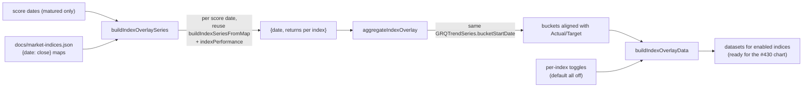

# Overlay benchmark indices on the Trend view (Issue #431)

## Summary

Adds the **headless benchmark-index overlay engine** for the new Trend view's
stretch goal: optionally overlay SP500 / NASDAQ / Russell 2000 as extra lines so
they can be compared against the portfolio Actual / Target series. Closes #431.

This mirrors the layered approach the milestone already follows: issue #429
shipped the Trend **data engine** (`docs/trend_series.js`) as a pure, DOM-free
module, leaving rendering to the Trend view UI sub-issue (#430). This PR adds the
matching **index-overlay layer** (`docs/index_overlay.js`, published on
`globalThis.GRQIndexOverlay`) — the pure data pipeline plus the per-index
on/off toggle-state model — so the UI sub-issue can drop it straight onto the
chart. Persistence of the toggle choices remains owned by the "remember choices"
sub-issue (#432).

### No new index maths (the issue forbids it)

Each index's value is **% return from the score-date baseline over the same
matured 90-day window** as Actual / Target, computed by reusing the existing
shared kernels — **no second calculation**:

- `GRQProjection.buildIndexSeriesFromMap` slices the same-origin
  `docs/market-indices.json` price map to the score date's 90-day window.
- `GRQMarketIndex.indexPerformance` applies the exact percentage formula the
  existing dashboard already plots benchmarks with.

### Aligned on the same X buckets

Maturity reuses `GRQTrendSeries.isMaturedScoreDate` and bucketing reuses
`GRQTrendSeries.bucketStartDate`, so an index point lands on the **same**
day/week/month/quarter bucket as the Actual / Target lines. Per-index bucket
values are the mean of their members' non-null returns.

### Per-index toggles, default all off

`DEFAULT_TOGGLES` is `{ sp500: false, nasdaq: false, russell2000: false }` — the
**documented default is all off**, so the Trend view starts uncluttered and the
user opts each benchmark in. `buildIndexOverlayData(...)` emits chart-ready
datasets for **only** the toggled-on indices, each carrying the distinct line
colour the existing dashboard already uses for that index (so the Trend view's
colour key / legend matches the rest of the site). Flipping a toggle changes
only which datasets are returned, which is how the UI will update the chart live.

### Scope / dependency note

The issue's UI acceptance points (live toggle widgets, colour-key wiring) depend
on the **Trend view UI** sub-issue (#430), which is not yet merged — there is no
chart to attach to. Following the #429 precedent, this PR delivers everything
that can be built and verified headlessly now; #430 wires
`GRQIndexOverlay.buildIndexOverlayData(...)` into the chart and the toggle
widgets. The existing dashboard is untouched (no `index.html` / `sw.js` change),
satisfying the "Existing dashboard untouched" criterion.

## Evidence

This is a headless data/state module — no DOM, no rendering — so there is no UI
to screenshot in this PR (the view itself arrives with #430). Verification is the
Deno test suite, which drives the **real shipped** helpers (no mocks): full suite
`701 passed | 0 failed`, including the new `tests/index_overlay_test.ts`.

## Test Plan

New `tests/index_overlay_test.ts` (imports the real `docs/index_overlay.js` and
its dependencies):

- `indexReturnForScoreDate` — % return from the score-date baseline over the
  90-day window; matches the shared `market_index` calc directly; null on an
  empty window and on a missing/invalid price map.
- `buildIndexOverlaySeries` — excludes non-matured score dates; per-index
  returns with a missing index resolved to null; chronological ordering.
- `aggregateIndexOverlay` — buckets align on `GRQTrendSeries.bucketStartDate`;
  per-index mean ignores null members; unknown granularity throws.
- `normaliseToggles` / `DEFAULT_TOGGLES` / `enabledIndexKeys` — all-off default,
  boolean coercion, unknown keys ignored.
- `buildIndexOverlayData` — default renders no index datasets; only toggled-on
  indices become datasets aligned to the shared buckets; null buckets are
  dropped from an enabled line.

Also added a parse guard for the new module in `tests/js_syntax_test.ts`
(`docs/index_overlay.js` parses cleanly).
