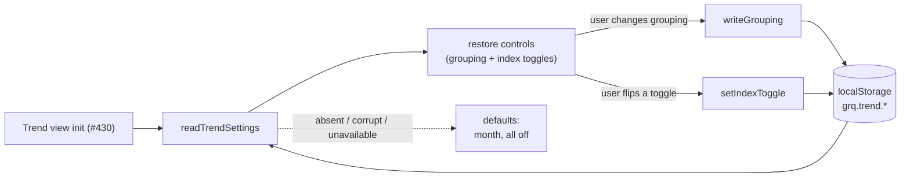

# Remember Trend-view choices across visits (Issue #432)

## Summary

Adds **`docs/trend_settings.js`** — the client-side settings helper that
remembers the Trend view's choices across visits, backed by `localStorage`
under namespaced `grq.trend.*` keys. Closes #432.

It persists the two selections #432 asks for:

- the **grouping granularity** — `day` / `week` / `month` / `quarter`
  (default **month**), under `grq.trend.grouping`; and
- each **benchmark-index on/off toggle** — SP500 / NASDAQ / Russell 2000
  (default **all off**), under `grq.trend.indices`.

This mirrors the layered approach the milestone already follows: #429 shipped
the Trend **data engine** (`docs/trend_series.js`) and #431 the **index-overlay
engine** (`docs/index_overlay.js`), both as pure, DOM-free modules that left
rendering to the Trend view UI sub-issue (#430). This PR adds the matching
**persistence layer** (published on `globalThis.GRQTrendSettings`) so the UI
sub-issue can call `readTrendSettings()` on view init to restore the controls,
and `writeGrouping(...)` / `setIndexToggle(...)` on change.

### Tolerates absent / corrupt / unavailable storage

Every storage access is guarded, so the acceptance criterion "no errors when
`localStorage` is unavailable (e.g. private mode)" holds:

- **First visit / cleared storage** → defaults apply (`month`, all indices off).
- **Corrupt value** → a non-granularity grouping or non-JSON toggles blob falls
  back to defaults rather than throwing.
- **Unavailable storage** → reads return defaults and writes report `false`
  (never throw); `setIndexToggle(...)` still returns a sane in-memory map so the
  live chart keeps working even when nothing can be saved.

### Single source of truth

The toggle shape and the granularity list are reused from the existing engines
when loaded — `GRQIndexOverlay.normaliseToggles` / `OVERLAY_INDICES` and
`GRQTrendSeries.GRANULARITIES` — with local fallbacks so the module still parses
and tests independently. No new index or grouping definitions are introduced.

### Scope / dependency note

The acceptance criteria's reload-restores-state flow depends on the **Trend view
UI** sub-issue (#430), which is not yet merged — there are no grouping/toggle
DOM controls to wire to (and `trend_series.js` / `index_overlay.js` are likewise
not yet loaded in `index.html`). Following the #429 / #431 precedent, this PR
delivers everything that can be built and verified headlessly now; #430 wires
`GRQTrendSettings` into the controls. The existing dashboard is untouched (no
`index.html` / `sw.js` change), satisfying the "No impact on the existing
dashboard" criterion.

## Evidence

This is a headless persistence/state module — no DOM, no rendering — so there is
no UI to screenshot in this PR (the `needs-screenshot` view itself arrives with
the Trend view UI sub-issue #430, which wires these helpers to real controls).
Verification is the Deno test
suite, which drives the **real shipped** helpers (no mocks) via an injectable
in-memory storage: full suite **730 passed | 0 failed**, including the new
`tests/trend_settings_test.ts`.

## Test Plan

New `tests/trend_settings_test.ts` (imports the real `docs/trend_settings.js`)
exercises the happy, error and edge paths:

- **Publication / keys** — `GRQTrendSettings` on `globalThis`; keys namespaced
  under `grq.trend.*`; granularities and default month exposed.
- **`normaliseGrouping`** — keeps the four valid granularities; junk / empty /
  null / wrong-type → `month`.
- **`normaliseToggles`** — all-off default; boolean coercion; unknown keys
  ignored.
- **Grouping round-trip** — `writeGrouping` → `readGrouping`; junk normalised to
  `month` before persisting; empty storage → default; corrupt value → default.
- **Toggle round-trip** — `writeToggles` → `readToggles`; empty → all-off;
  corrupt (non-JSON) → defaults; partial stored object normalised.
- **`setIndexToggle`** — flips a single index while persisting the rest across
  successive writes; unknown index key ignored.
- **Combined settings** — `writeTrendSettings` → `readTrendSettings`; defaults
  on first visit.
- **Unavailable storage** — throwing storage and explicit `null` storage: reads
  fall back to defaults, writes return `false` (never throw), `setIndexToggle`
  still returns a sane map.

Also added a parse guard for the new module in `tests/js_syntax_test.ts`
(`docs/trend_settings.js` parses cleanly).
