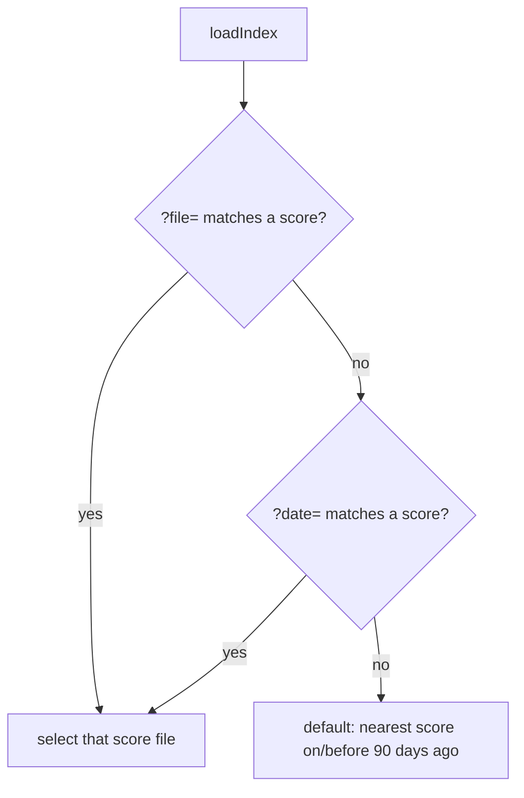

# Send dates via a URL parameter (issue #436)

## Summary

The dashboard could already be deep-linked to a score via `?file=`, but that
needs the URL-encoded score-file path (`?file=2026%2FMarch%2F23.tsv`) — awkward
to type or share. This PR adds a friendlier `?date=<YYYY-MM-DD>` query parameter
that pre-selects the score for a given date, e.g.
`index.html?date=2026-03-23`. Closes #436.

- New pure helper module `docs/date_selection.js` (mirrors
  `docs/stock_selection.js`): `dateFromSearch()` reads the `?date=` value and
  `resolveDateSelection()` maps it to the matching score-file path. Unpadded
  month/day (`2026-3-23`) is accepted; an unknown or malformed date returns
  `null` so the dashboard falls back to its normal default selection.
- `docs/app.js` `loadIndex()` now resolves the requested score from either
  `?file=` or `?date=`. `?file=` keeps precedence when both are present, so
  existing links are unaffected.
- `docs/index.html` loads `date_selection.js` before `app.js` (same pattern as
  the other helper modules). The CSP (`script-src 'self'`) already permits the
  same-origin script; no change needed.
- README deep-link section documents the new parameter.

The helper touches no DOM and uses no module syntax, so it imports cleanly
under both the browser and Deno.



## Evidence

No browser automation tool (Playwright MCP / headless Chrome) was available in
this environment, so no screenshot could be captured. The behaviour is instead
verified by behavioural unit tests and an end-to-end resolution against the real
committed `docs/scores/index.json`:

```
2026-06-22 -> 2026/June/22.tsv
2026-6-22  -> 2026/June/22.tsv   (unpadded accepted)
2099-01-01 -> null               (unknown date → fallback)
garbage    -> null               (malformed → fallback)
?date=2026-06-22&stock=X -> 2026-06-22  (parsed alongside other params)
```

`./quality.sh` passes cleanly (Rust fmt/clippy/check/test + full Deno suite of
678 tests).

## Test Plan

- Added `tests/date_selection_test.ts` exercising the real shipped helpers from
  `docs/date_selection.js`:
  - `dateFromSearch` extracts the date, works alongside other params, trims
    whitespace, and returns `null` when absent/blank/non-string.
  - `resolveDateSelection` matches by exact date, accepts unpadded month/day,
    and returns `null` for unknown dates, malformed input, and non-array
    score lists.
- All existing Rust and Deno tests continue to pass.
