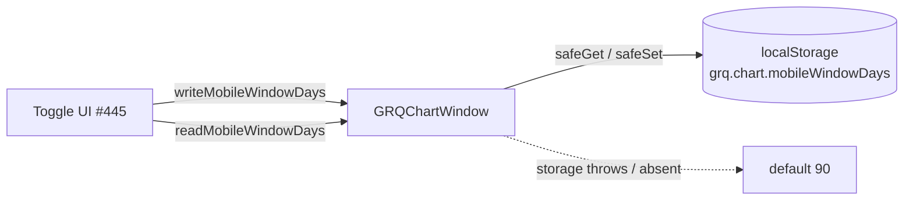

# feat: persist per-device mobile chart-window choice (90/180) — GRQChartWindow helper

## Summary

Adds a small **pure persistence helper** that remembers, per device, the
user's choice of mobile chart window: **90 days (default)** or the full
**180 days**. This is the storage foundation that the toggle UI sub-issue of
milestone #445 will read/write — no DOM and no chart, persistence only.

The new module `docs/chart_window_settings.js` is modelled exactly on the
existing `docs/trend_settings.js` (issue #432): it is a classic `<script>`
with no module syntax, publishes its helpers on `globalThis.GRQChartWindow`,
stores under the namespaced key `grq.chart.mobileWindowDays`, and guards every
storage access so private mode / unavailable / throwing storage falls back to
the default `90` without ever throwing.

Closes #447.

### Public API (`globalThis.GRQChartWindow`)

- `STORAGE_KEY` — `"grq.chart.mobileWindowDays"`
- `MOBILE_WINDOW_DAYS_DEFAULT` — `90`
- `ALLOWED_WINDOW_DAYS` — `[90, 180]`
- `normaliseWindowDays(value)` — coerces anything outside `{90, 180}` (missing /
  corrupt / `"abc"` / `0`) to `90`; also accepts numeric strings from storage
- `readMobileWindowDays(storage)` — returns the persisted window or `90`
- `writeMobileWindowDays(value, storage)` — normalises then persists; returns
  whether the write succeeded

Storage is injectable on every read/write: omitted → ambient `localStorage`;
explicit `null` → no-storage.

### Wiring

- `docs/chart_window_settings.js` added to `docs/index.html` script includes
  (alongside `projection.js`), so it is available to the dashboard. Wiring the
  value into the chart/summary is the UI sub-issue's job.
- Added to the service worker precache list in `docs/sw.js` (mirroring
  `trend_settings.js`) so it is available offline, and bumped `APP_VERSION`
  `1.0.212 → 1.0.213` (aligned across `sw.js`, `sw-register.js`, `index.html`,
  `trend.html`) to purge stale caches.

## Evidence

Backend/persistence-only change with no new visible UI — the toggle that
surfaces this choice is the separate UI sub-issue. Verified via the new Deno
behavioural test suite (13 tests, all passing) and the full `./quality.sh`
gate (756 tests passing, lint + type-check clean).

## Test Plan

Added `tests/chart_window_settings_test.ts`, mirroring
`tests/trend_settings_test.ts`:

- publishes `globalThis.GRQChartWindow` with the default `90` and allowed `[90, 180]`
- `STORAGE_KEY` namespaced under `grq.chart.*`
- `normaliseWindowDays` keeps `90`/`180`, coerces numeric strings, and falls
  back to `90` for junk (`"abc"`, `0`, `30`, `""`, `null`, `undefined`, `{}`)
- write→read round-trips `90` and `180`; junk normalised to `90` before persisting
- default `90` returned when storage empty or corrupt
- injected throwing storage → read returns `90`, write returns `false` (never throws)
- explicit `null` storage → read returns `90`, write returns `false`
