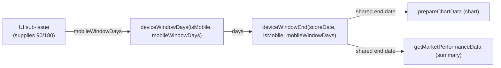

## Summary

Taught the single source-of-truth window helpers in `docs/projection.js` to
honour a chosen mobile window of **90 (default) or 180** days, while desktop
stays at **180** and the chart and summary keep ending on the same date (the #367
invariant). Pure-function change only — no DOM, no storage. `Closes #448`.

- `deviceWindowDays(isMobile, mobileWindowDays = 90)` — on mobile returns the
  chosen value only when permitted (90 or 180), else falls back to 90; on
  desktop always returns 180 (the toggle never affects desktop).
- `deviceWindowEnd(scoreDate, isMobile, mobileWindowDays = 90)` — threads the
  chosen window through, still returning `null` for a missing/unparseable score
  date (blank-on-missing preserved).
- Defaults equal today's behaviour, so all existing callers are unaffected until
  the UI sub-issue passes a value — the #367 single-source guarantee holds.
- `projection.js` stays pure: no `localStorage` / DOM access added; the caller
  supplies the value.

## Evidence

Pure-maths change with no web interface to screenshot. Verified via unit tests
covering the acceptance criteria:

- `deviceWindowDays(true)` → 90; `(true, 180)` → 180; `(true, 999)` → 90;
  `(false, 180)` → 180 (desktop ignores the override).
- `deviceWindowEnd(scoreDate, true, 180)` ends 180 days after the score date;
  `(scoreDate, false, 90)` still ends 180 days after; null/unparseable → `null`.
- Chart and summary resolve to the same end date for each `(isMobile,
  mobileWindowDays)` pair, including the new `(mobile, 180)` case.

`./quality.sh` passes cleanly.

## Test Plan

- Added `tests/projection_kernels_test.ts::deviceWindowDays honours a permitted
  mobile window, desktop ignores the override` and `::deviceWindowEnd threads
  the chosen mobile window through to the end date`.
- Extended `tests/chart_summary_window_test.ts` with `deviceWindowDays/
  deviceWindowEnd - selectable mobile window keeps chart and summary on the SAME
  end date (issue #448)`, covering the new `(mobile, 180)` case.
- Cross-checked `tests/chart_summary_direction_consistency_test.ts` — still
  passes unchanged.
