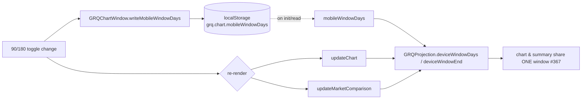

# Mobile-only 90/180-day chart window toggle (Issue #449)

## Summary

Adds a **mobile-only 90/180-day toggle** near the dashboard chart and wires it
up so a phone user can switch the visible window between **90 days (default)**
and the **full 180 days**. The choice persists per device (localStorage, via the
existing `GRQChartWindow` helper) and re-renders the chart **and** the "Market
Performance Comparison" summary **together**, so they always cover the identical
window and can never disagree in direction (#367). Desktop is unchanged: the
toggle is never shown and the chart always renders 180 days.

Closes #449.

### What changed

- **`docs/projection.js`** — `deviceWindowDays`/`deviceWindowEnd` now take the
  chosen mobile window as an optional third argument (`mobileWindowDays`). On
  mobile they honour 90 (default) or 180; desktop is always 180. The argument is
  backward compatible — omitting it keeps the prior 90-day mobile default — and
  out-of-range values fall back to 90 via `normaliseMobileWindowDays`.
- **`docs/index.html`** — a labelled, keyboard-operable Bootstrap radio group
  (`#chartWindowControl`, "90 days" / "180 days") inside the chart card, before
  the canvas. Default selection is 90. Accessible via `role="group"` +
  `aria-labelledby` and native `<label for>`/radio inputs.
- **`docs/styles.css`** — `.chart-window-control` is `display: none` on desktop
  and revealed (`display: flex`) only inside the existing `@media (max-width:
  768px)` block — the same boundary `isMobileDevice()` uses.
- **`docs/app.js`** — `initChartWindowToggle()` restores the stored choice on
  init and, on change, persists via `GRQChartWindow.writeMobileWindowDays(...)`
  then calls `updateChart()` **and** `updateMarketComparison()`. The chosen
  window (`this.mobileWindowDays()`) is threaded through every window call site:
  the summary (`getMarketPerformanceData`), the chart (`prepareChartData`) and
  the cost-of-capital line (`calculateCostOfCapitalData`).

### Data flow

## Evidence

Captured via headless Chrome against the static dashboard served from `docs/`.

**Mobile (< 768px): toggle visible near the chart, default 90 selected.**

**Flipping 90 → 180 widens the chart and summary together.** For an older score
(2025-06-29) where 180 days of data exist, the "Market Performance Comparison"
figures move in lockstep with the choice — SP500 +7.1% → +11.7%, NASDAQ +10.4%
→ +15.8%, Russell +11.9% → +16.5% — proving chart and summary share one window.

| 90 days | 180 days |
| --- | --- |
|  |  |

**Desktop (≥ 768px): toggle hidden, full 180-day chart unchanged.**

## Test Plan

- **`tests/chart_window_toggle_test.ts`** (new) — pins the toggle markup
  (present near the chart, 90/180 choices, default 90), accessibility (labelled
  radio group, `<label for>`, native radios), mobile-only CSS (hidden on
  desktop, revealed < 768px, reveal confined to the mobile block) and the app.js
  wiring (reads/writes `GRQChartWindow`, change handler re-renders both chart and
  summary, call sites pass the chosen window).
- **`tests/chart_summary_window_test.ts`** (extended) — `deviceWindowDays`/
  `deviceWindowEnd` honour the chosen mobile window (90 default, 180 opt-in,
  junk → 90, desktop always 180); a mobile 180 choice ends on the exact desktop
  window date; and the summary fed the mobile-180 window matches the desktop
  summary exactly (shared-window invariant for the 180 selection).
- **Re-ran** `tests/chart_summary_direction_consistency_test.ts` and
  `tests/chart_window_settings_test.ts` — green, confirming the shared-window
  invariant and persistence still hold after wiring.
- Full gate: `./quality.sh` passes (Rust fmt/clippy/test/build + 769 Deno tests,
  lint, check, fmt).

### Deno regression avoided

Window resolution stayed in the shared `docs/projection.js` classic-script
module exercised by Deno tests — no Node tooling, bundler or `package.json`
introduced.
