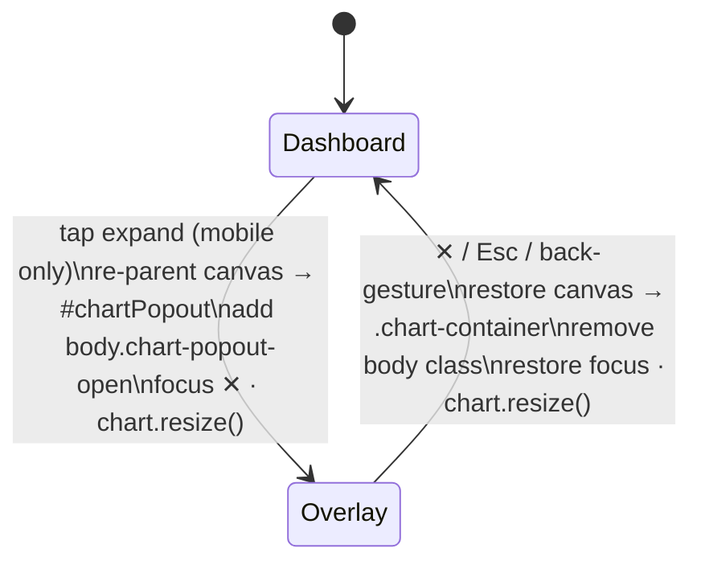

## Summary

Adds a **mobile-only pop-out overlay for the performance chart** — the core
open/close lifecycle of milestone #446. On a viewport `< 768px` an expand
control appears on the chart card; tapping it pops the single live
`#performanceChart` canvas out into a full-viewport overlay (`#chartPopout`),
locks background scroll, and resizes the chart to fill the screen. ✕, Esc and
the device back-gesture all close it, restoring the canvas to `.chart-container`
exactly as before. Desktop (`≥ 768px`) never sees the control and is unchanged.

Because there is exactly one Chart.js instance, the overlay **re-parents the
existing canvas** rather than building a second chart, calling
`chart.resize()` / `chart.update()` after each move so the chart fits its new
box. No chart data, the 90/180-day window, or the colour-key/legend logic is
touched (those belong to siblings #452/#453).

Closes #451.

### Contract exposed for the sibling sub-issues
- Overlay container id: `#chartPopout` (with `#chartPopoutBody` hosting the canvas).
- Body state class while open: `body.chart-popout-open`.

### Changes
- **`docs/chart_popout.js`** (new) — dependency-injected open/close engine
  published on `globalThis.GRQChartPopout`. Pure `openPopout`/`closePopout`/
  `togglePopout` core plus `createChartPopout()` wiring (tap, ✕, Esc, and a
  pushed history entry so the back-gesture pops the overlay).
- **`docs/index.html`** — mobile expand button (`#chartPopoutExpand`,
  `aria-label`), the hidden `role="dialog"` overlay with a labelled ✕ close
  button, and the `chart_popout.js` script tag before the app bootstrap.
- **`docs/app.js`** — wires the engine to the live chart via
  `getChart: () => validator.chart`.
- **`docs/styles.css`** — mobile-only trigger (`display:none` at `≥768px`),
  full-viewport overlay, and `body.chart-popout-open { overflow: hidden }`.
- **PWA** — added `./chart_popout.js` to `STATIC_ASSETS` in `docs/sw.js` and
  bumped `APP_VERSION` 1.0.212 → 1.0.213 across `sw.js`, `sw-register.js`,
  `index.html` and `trend.html` so returning mobile users get the new shell.
- **`README.md`** — dashboard feature note + docs file-tree entry.

### Accessibility
- Expand and close controls have `aria-label`s.
- Focus moves to the close button on open and is restored to the trigger on close.
- The overlay is `role="dialog" aria-modal="true"`; background scroll is locked
  via the body class.
- `pa11y-ci` stays green: **6/6 URLs, 0 errors**.

## Evidence

Mobile chart with the expand control (top-right of the chart):

Overlay open — full-viewport chart with the ✕ close control:

Headless CDP checks confirmed the runtime contract: at 390px the control is
visible (`display:flex`), opening sets `#chartPopout.hidden = false`,
`body.chart-popout-open` is added, and the canvas is re-parented into
`#chartPopoutBody`. At 1200px the control is `display:none` and the overlay
stays hidden.

## Test Plan

- Added **`tests/chart_popout_test.ts`** — 17 Deno tests over the real shipped
  engine using a minimal fake DOM:
  - open: overlay shown, `aria-hidden=false`, `body.chart-popout-open` added,
    canvas re-parented into the overlay, focus → close button, chart
    resized+updated;
  - close: canvas restored to the container, overlay hidden, body class removed,
    focus restored to the trigger, chart resized again;
  - `togglePopout`, no-op guards (open-when-open / close-when-closed), and
    tolerance of a missing chart instance;
  - `createChartPopout()` end-to-end open/close via an injected document;
  - production `docs/chart_popout.js` parses cleanly; `index.html` loads it
    before the bootstrap and exposes the `#chartPopout` / `#chartPopoutExpand`
    contract; `sw.js` precaches it.
- `./quality.sh` passes (cargo fmt/clippy/test/build + 760 Deno tests).
- `pa11y-ci` green (6/6, 0 errors).
