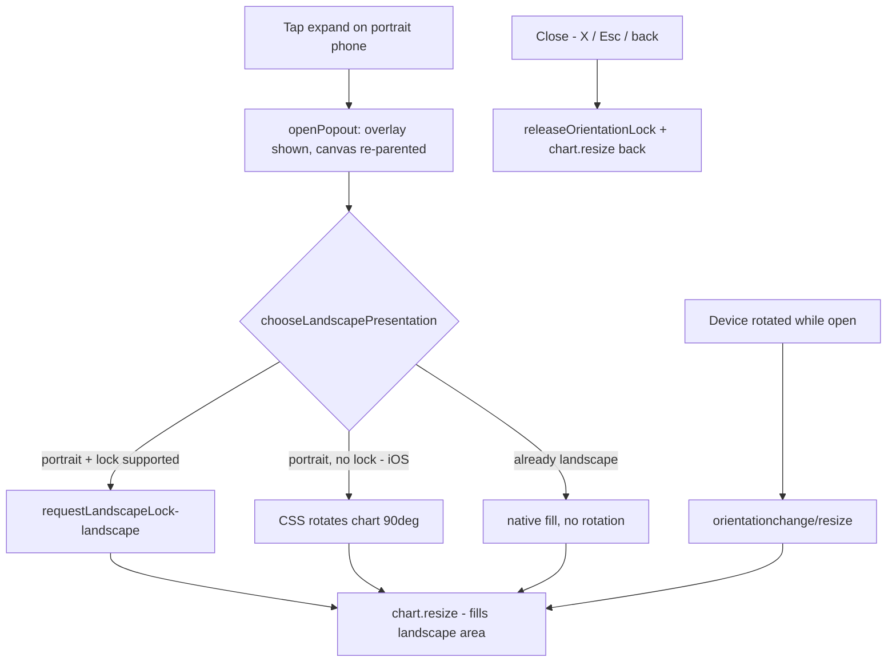

# feat: landscape presentation inside the mobile chart pop-out

## Summary

Builds on the #451 pop-out overlay (milestone #446): once the performance
chart pops out to a full-viewport overlay, present it in **landscape** so a
wide chart is easy to read on a portrait phone. Desktop is unchanged.

Two layers cover every device:

- **CSS baseline (robust, carries iOS Safari).** A portrait + mobile media
  query rotates `.chart-popout-body` 90° and sizes it to the *swapped*
  viewport (`width: 100vh; height: 100vw`), so the rotated chart fills the
  screen with no clipping/letterboxing. Chart.js (`responsive`,
  `maintainAspectRatio: false`) fits the canvas to this box. This needs no
  JS and is the safety net where orientation lock is unavailable.
- **Optional progressive enhancement.** Where the platform supports it,
  `screen.orientation.lock('landscape')` is attempted on open and released
  on close. iOS Safari has no `.lock()`, so it silently no-ops and the CSS
  fallback applies — no console errors, no broken layout.

`docs/chart_popout.js` gains pure, dependency-injected helpers and wiring
that locks on open, unlocks on close, and calls `chart.resize()` on
rotate/resize while open so the chart always fills the landscape area.

Closes #452.

## Evidence

Mobile-portrait (390×844) pop-out, captured headless via Chromium: the chart
is rotated into a large landscape presentation filling the phone, clearly
larger than the inline dashboard chart, with the ✕ close control reachable
top-right.

### Open/rotate flow

## Test Plan

New `tests/chart_landscape_test.ts` (20 tests) exercises the **real shipped**
logic headless via injected `screen` / `viewport` stubs:

- `isPortraitViewport` — portrait vs landscape vs square/missing.
- `supportsOrientationLock` — true with `.lock()`, false on iOS-style screen
  and when absent (capability detection).
- `chooseLandscapePresentation` — `orientation-lock` / `css-rotate` /
  `native` decision matrix.
- `requestLandscapeLock` — requests landscape, silently swallows a rejected
  or throwing `lock()`, no-ops on iOS.
- `releaseOrientationLock` — unlocks where supported, silent no-op otherwise.
- `createChartPopout` wiring — locks on open only when portrait + supported,
  no lock when already landscape, graceful on iOS, and resizes the chart on
  `orientationchange` while open (not once closed).
- `styles.css` — asserts the portrait media block rotates `.chart-popout-body`
  90° and swaps the dimensions.

Existing `tests/chart_popout_test.ts` (16 tests) still passes — the #451
open/close core is untouched. Full suite: **780 passed, 0 failed**;
`deno fmt`/`lint`/`check` clean.

No Rust touched (frontend JS/CSS + Deno tests only). pa11y is unaffected: the
new rules live entirely inside a `max-width: 767.98px and orientation:
portrait` block, so the desktop a11y runs are identical.
