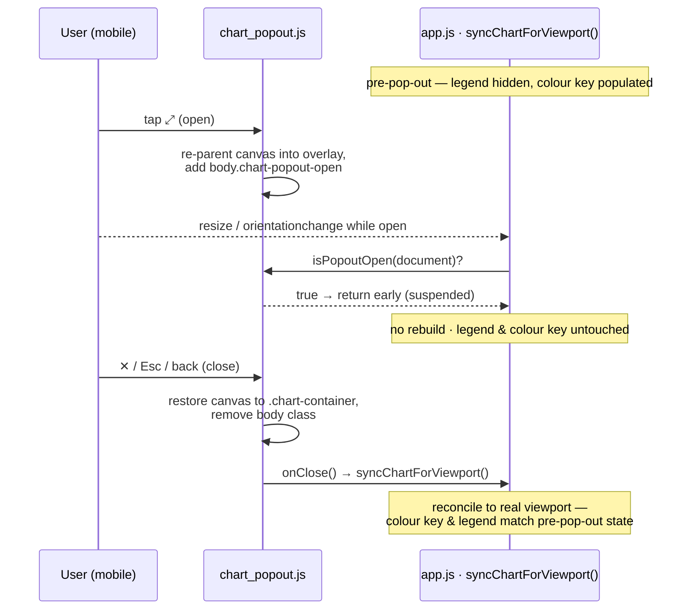

# chart-only pop-out — reconcile dashboard legend/colour key on close (#453)

## Summary

Sub-issue of #446. The mobile chart pop-out (#451) re-parents the single live
`#performanceChart` canvas into an **opaque, full-viewport** overlay
(`.chart-popout`, `background: var(--grq-surface)`, `position: fixed; inset: 0`).
Because only the canvas moves into the overlay, the pop-out already renders
**just the chart** — with its Chart.js axes, scales and tick labels intact — while
the mobile colour key (`#chartColorKey`) and all dashboard chrome (cards,
headings, market comparison, tables) stay behind the overlay. This PR owns the
remaining half of the sub-issue: **keeping the underlying dashboard correct after
the shared canvas is moved out and back**.

Without reconciliation, a resize/orientation event fired while the overlay is
open would run the debounced `syncChartForViewport()` and — if the
device crossed the mobile/desktop breakpoint (e.g. a landscape rotation) —
rebuild the chart/summary and clear `#chartColorKey` behind the overlay, leaving
it stale when the canvas returned on close. The fix suspends that sync while the
pop-out owns the canvas and reconciles once on close:

- **`docs/chart_popout.js`**
  - Add `isPopoutOpen(doc)` — a pure predicate reading the `body.chart-popout-open`
    contract class, published on `globalThis.GRQChartPopout`.
  - Add an optional `onClose` hook to `createChartPopout()`, fired in
    `finishClose()` once the canvas is back in `.chart-container` (guarded so a
    throwing hook never leaves the overlay half-closed).
- **`docs/app.js`**
  - `syncChartForViewport()` returns early while `isPopoutOpen(document)` is true,
    so opening, closing or rotating inside the pop-out never triggers a spurious
    chart/summary rebuild via the breakpoint-crossing path, and never clears the
    mobile colour key behind the overlay. `lastViewportIsMobile` stays frozen at
    its pre-pop-out value, so no false "crossing" is recorded.
  - The pop-out is wired with `onClose: () => syncChartForViewport()`, reusing the
    shared `renderColorKey()` + legend-sync logic (not a duplicate) to restore the
    colour key and native legend to their pre-pop-out state.

Desktop is unchanged — the expand trigger is CSS-hidden at ≥768px, so the overlay
can never be opened there.

Closes #453.

## Evidence

Playwright MCP and pa11y were unavailable in this run, so no browser screenshot
could be captured. The behaviour is covered by headless Deno tests that drive the
**real shipped** `chart_popout.js` module through a fake DOM, asserting the exact
acceptance criteria (state preserved across open/close and open/rotate/close, and
the sync suspended while open).

## Test Plan

New `tests/chart_popout_reconcile_test.ts` (exercises the real module):

- `isPopoutOpen - reflects the body contract class`
- `isPopoutOpen - tolerates a missing/partial document`
- `syncChartForViewport stays idle while the pop-out is open` — a breakpoint-crossing
  resize while open produces no rebuild and leaves legend + colour key untouched.
- `closing the pop-out preserves the colour key and legend (open/close)`
- `closing preserves state across an open → rotate → close cycle`
- `onClose reconcile is optional - close still works without it`

Existing `tests/chart_popout_test.ts` (16 tests) and the full Deno suite (786
tests) remain green. `./quality.sh` passes.
