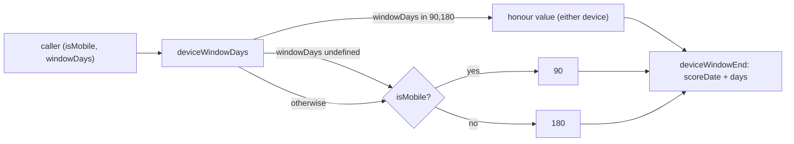

# Relax the desktop-180 chart-window lock (foundation)

## Summary

Relaxes the hard desktop-180 lock in the pure window helper
(`docs/projection.js`) so a permitted **90-day** choice can take effect on
desktop. `deviceWindowDays`/`deviceWindowEnd` now honour an **explicit permitted
value (90 or 180) on either device**, while each device keeps its own default
when the value is missing or invalid:

- desktop default stays **180**; desktop with an explicit `90` → **90** (NEW);
- mobile default stays **90**; mobile with an explicit `180` → **180** (unchanged
  from #448).

The helper stays **pure** — the caller supplies the value, the function never
reads `localStorage` — preserving the #367 single-source chart/summary
guarantee. The device-neutral allow-list constant is renamed
`PERMITTED_MOBILE_WINDOW_DAYS` → `PERMITTED_WINDOW_DAYS` (`[90, 180]`).

This is the foundation sub-issue of milestone #457; the toggle UI, the desktop
`GRQChartWindow` persistence key, and `?window=` URL honouring land in their own
sub-issues. No UI, persistence, or `localStorage` changes here. Closes #464.

## Implementation

The old helper hard-returned `DESKTOP_WINDOW_DAYS` on desktop, discarding any
supplied value. The new helper resolves a per-device default and honours an
explicit permitted value on either device:

```js
function deviceWindowDays(isMobile, windowDays) {
    const deviceDefault = isMobile ? MOBILE_WINDOW_DAYS : DESKTOP_WINDOW_DAYS;
    if (windowDays === undefined) return deviceDefault;
    return PERMITTED_WINDOW_DAYS.includes(windowDays)
        ? windowDays
        : deviceDefault;
}
```

`deviceWindowEnd` threads `windowDays` through unchanged (no implicit default
parameter, so omitting it falls back to the device default rather than a fixed
90). `null`/blank-on-missing-score-date behaviour is unchanged.



## Evidence

Backend/pure-module change with no web interface to screenshot. Verified via the
Deno unit tests below. `deno test --allow-read tests/*.ts` → **769 passed, 0
failed**; `deno fmt`, `deno lint`, and `deno check` all clean.

## Test Plan

Extended the two suites named in the acceptance criteria:

- `tests/projection_kernels_test.ts`
  - `deviceWindowDays honours an explicit permitted window on either device,
    each device keeps its own default` — asserts the full matrix:
    `(false)`→180, `(false, 90)`→**90** (new), `(false, 180)`→180,
    `(false, 999)`→180, `(true)`→90, `(true, 180)`→180, `(true, 90)`→90,
    `(true, 999)`→90.
  - `deviceWindowEnd threads the chosen ... window through to the end date` —
    added a desktop-90 case (`(scoreDate, false, 90)` → scoreDate + 90 days) and
    a desktop-default case; mobile cases unchanged.
- `tests/chart_summary_window_test.ts`
  - Extended the shared-window pair matrix with `[false, undefined]`,
    `[false, 90]`, and `[false, 999]`, and added a symmetric assertion that the
    desktop-90 window lands on the same end date as the mobile default window.

### Business-logic test changes (documented)

The lock is being deliberately relaxed, so two previously-correct assertions
encoding the old desktop-180 lock were updated (not removed):

- `deviceWindowDays(false, 90)` expectation changed from `180` → `90`.
- `deviceWindowEnd(scoreDate, false, 90)` expectation changed from
  `scoreDate + 180` → `scoreDate + 90`.

Stale "desktop ignores the override" comments were updated accordingly.

## Scope notes

`docs/app.js` is intentionally untouched — the toggle/persistence wiring belongs
to separate sub-issues of milestone #457. This PR targets the milestone branch
`milestone/457-feat-let-desktop-optionally-use-the-90-day-cha`.
