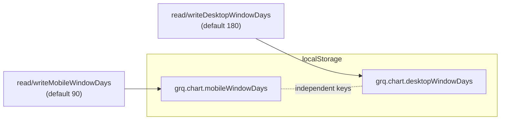

## Summary

Persist a **per-device desktop** 90/180 chart-window choice in the existing
`GRQChartWindow` helper (`docs/chart_window_settings.js`), with a desktop
default of **180**. Desktop gets its **own** storage key and its **own**
default, so a desktop selection is remembered per device and can **never**
regress mobile's required 90-day default (parent invariant #457). Pure
persistence — no DOM, no chart. Closes #465.

### Changes
- New key `grq.chart.desktopWindowDays` (`DESKTOP_STORAGE_KEY`), separate from
  the mobile key.
- New default `DESKTOP_WINDOW_DAYS_DEFAULT = 180`.
- `normaliseWindowDays(value, fallback)` is now parameterised — an omitted
  `fallback` preserves the original mobile-90 behaviour for existing callers;
  desktop passes 180 so missing / corrupt / out-of-range values fall back to
  180.
- New helpers `readDesktopWindowDays(storage)` / `writeDesktopWindowDays(value,
  storage)`, published on `globalThis.GRQChartWindow` alongside the mobile
  helpers.
- Mobile key, mobile default (90), and `read/writeMobileWindowDays` left
  **completely unchanged**. Allowed values remain `[90, 180]`.

This is a backend/persistence-only change (no web UI), so evidence is the test
suite below rather than a screenshot.

## Evidence

Separate keys mean a desktop write never changes what mobile reads, and
vice-versa — verified by the independence tests.

`deno test tests/chart_window_settings_test.ts` → **27 passed | 0 failed**.
`./quality.sh` → ✅ completed successfully.

## Test Plan

Extended `tests/chart_window_settings_test.ts`:
- Desktop helpers published; `DESKTOP_WINDOW_DAYS_DEFAULT === 180`.
- `DESKTOP_STORAGE_KEY` is its own `grq.chart.*` key, distinct from the mobile
  key.
- `normaliseWindowDays(value, 180)` honours the explicit desktop fallback.
- Desktop read with empty / absent / null / throwing storage → **180**.
- `writeDesktopWindowDays(90)` then read → 90; `writeDesktopWindowDays(180)`
  then read → 180.
- Corrupt / out-of-range desktop value → 180 (read and write).
- Desktop write reports failure (not throw) in no-storage / private-mode paths.
- **Independence:** writing the desktop key never changes
  `readMobileWindowDays` (still 90 on empty storage), and writing the mobile
  key never changes `readDesktopWindowDays` (still 180); both choices coexist.

All pre-existing mobile tests remain unchanged and green.
