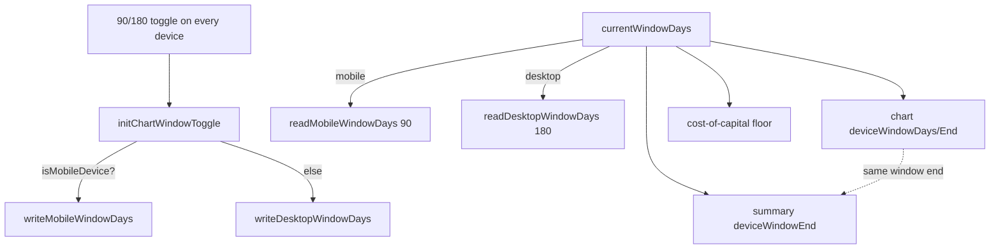

# Extend the 90/180 chart-window toggle to desktop

## Summary

The 90/180-day chart-window control was phone-only: desktop hid it via CSS and
always rendered the full 180-day window. This change renders the same control on
**desktop** too and wires the chart **and** the "Market Performance Comparison"
summary to honour the per-device choice. Desktop default stays **180**; choosing
90 narrows both the chart and the summary together to the same end date (#367).
Mobile is unaffected — it keeps defaulting to 90 from its own store.

Both foundation sub-issues of #457 were already merged on the milestone branch
(the `projection.js` desktop-180 lock relaxation and the desktop
`GRQChartWindow` persistence key), so this PR is purely the desktop UI reveal +
per-device wiring.

`Closes #466`

### What changed

- **`docs/styles.css`** — relaxed the base `.chart-window-control { display:
  none }` to `display: flex` so the control renders on every device; the phone
  `@media` reveal is kept explicit.
- **`docs/index.html`** — dropped the "Mobile-only" comment. The static `90`
  default on the markup is corrected per device on init by the wiring below.
- **`docs/app.js`**
  - added `desktopWindowDays()` reading `GRQChartWindow.readDesktopWindowDays()`
    (default 180), parallel to `mobileWindowDays()`;
  - added `currentWindowDays()` = `isMobileDevice() ? mobileWindowDays() :
    desktopWindowDays()` as the single effective-window accessor;
  - `initChartWindowToggle()` now restores from, and persists to, the **current
    device's** store (mobile → `writeMobileWindowDays`, desktop →
    `writeDesktopWindowDays`);
  - the three window-sizing call sites (summary `deviceWindowEnd`, chart
    `deviceWindowDays`/`deviceWindowEnd`, cost-of-capital floor) now pass
    `currentWindowDays()`, so a desktop 90 choice narrows chart and summary
    together.

### Data flow

## Evidence

Desktop (1280px) now shows the **Chart window** control with **180 days**
selected by default:

The desktop 90 → chart/summary narrowing is proven behaviourally (see tests
below): a desktop 90 window lands on the **identical** end date as mobile's
default 90 window and reads DOWN on the #333-shaped fixture, exactly matching the
chart's last visible point.

## Test Plan

`deno test --allow-read tests/*.ts` → **786 passed, 0 failed**.

- `tests/chart_window_toggle_test.ts` — updated for the desktop path:
  - base CSS now shows the control on desktop (no `display: none`), phone reveal
    retained;
  - init reads **both** `readMobileWindowDays` and `readDesktopWindowDays`;
  - new assertions that `currentWindowDays()` / `desktopWindowDays()` exist and
    branch on `isMobileDevice()`, and that the change handler persists to the
    current device's store (`writeMobileWindowDays` vs `writeDesktopWindowDays`);
  - call sites now pass `this.currentWindowDays()` (no longer the mobile-only
    accessor).
- `tests/chart_summary_window_test.ts` — added a desktop-90 end-to-end case:
  `marketPerformanceData` narrows to the dip (DOWN), lands on the same end date
  as the mobile default 90 window, and is strictly narrower than the desktop 180
  window.
- `tests/chart_summary_direction_consistency_test.ts` — added a `desktop-90`
  window to the matrix so chart↔summary direction/magnitude alignment is
  asserted at the desktop 90 opt-in.

### Acceptance check

- ✅ Desktop shows the 90/180 control; default selection is 180.
- ✅ Flipping desktop to 90 narrows chart **and** summary to a 90-day window on
  the same end date; flipping back to 180 restores it (shared
  `currentWindowDays()` source of truth).
- ✅ Reload remembers the desktop choice per device; mobile unaffected (own key,
  90 default).
- ✅ `deno test` green.
