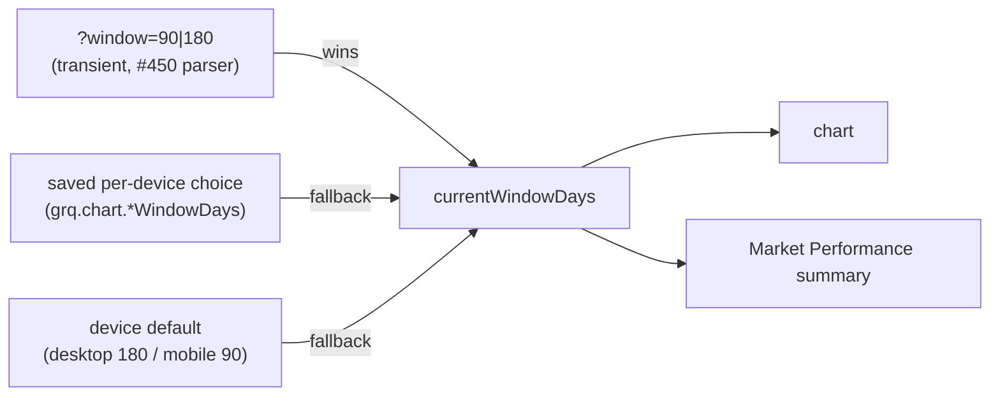

## Summary

Make a `?window=90` / `?window=180` deep link take effect **on desktop**
(and mobile), **visit-only**, so a shared link can switch the chart — and the
aligned Market Performance summary — to a 90- or 180-day window without writing
the saved per-device preference. Closes #467.

Parsing of `?window=` is owned by #450; since #450 has not merged yet, this PR
adds the **single shared parser** (`windowDaysFromSearch`) alongside the
existing window helpers so #450 can consume the same implementation — the
parameter is built **once**, not twice.

What changed:

- `docs/chart_window_settings.js` — adds two pure helpers on
  `globalThis.GRQChartWindow`, mirroring `theme.js`'s `preferenceFromSearch`:
  - `windowDaysFromSearch(search)` — the shared `?window=` parser. Returns `90`
    or `180` for a permitted value, else `null` (absent / blank / disallowed).
  - `effectiveWindowDays(search, savedWindowDays)` — the visit-only precedence
    resolver: a `?window=` URL override **wins** over the saved per-device
    choice, which wins over the device default. Pure — it writes nothing, so a
    URL-supplied window is honoured for the visit only.
- `docs/app.js` — `currentWindowDays()` now resolves the saved per-device value
  (mobile 90 / desktop 180) and then applies the transient `?window=` override
  through `effectiveWindowDays`. Because every window-sizing call site (chart,
  summary, cost-of-capital floor) already routes through this single accessor,
  a `?window=90` link narrows the chart **and** the summary together, ending on
  the same date (#367). The URL value is **never** persisted, so a reload
  without the param returns to the saved/180 window. Guarded so a missing helper
  degrades cleanly to the saved value.
- `README.md` — documents the new `?window=90|180` transient deep link.

### Precedence

### Mobile invariant

A `?window=` value is per-visit only and writes nothing, so a desktop link
never changes mobile's stored 90 default. With no override, mobile still
resolves to its saved/90 value.

## Evidence

Backend/front-end logic change with no new visual chrome (the toggle UI and
styles ship under #466). Verified behaviourally via the Deno test suite — the
new parser and precedence resolver are exercised against the real shipped
helpers. Full suite green: `deno test --allow-read tests/*.ts` → `799 passed`.

## Test Plan

- Added `tests/chart_window_url_test.ts` (real-function behavioural tests):
  - `windowDaysFromSearch` — `?window=90`/`?window=180` parse to `90`/`180`;
    leading `?` optional; whitespace tolerated; absent / blank / disallowed /
    rubbish input → `null` (never throws).
  - `effectiveWindowDays` — `?window=90` overrides a saved desktop `180`;
    `?window=180` overrides a saved desktop `90`; absent/invalid falls back to
    the saved value; mobile's `90` default is preserved when no override is
    present (override is per-visit, writes nothing).
- Existing `tests/chart_window_settings_test.ts` and
  `tests/chart_window_toggle_test.ts` continue to pass unchanged (no persisted
  behaviour altered).
