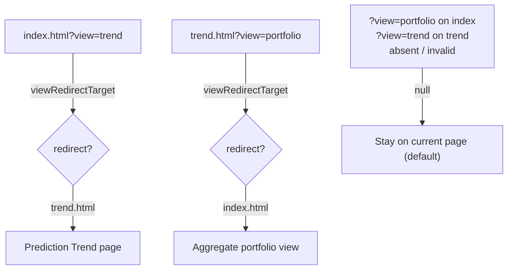

# feat: `?view=portfolio|trend` deep-link to select the dashboard view

## Summary

Adds a transient `?view=` deep-link parameter that selects which top-level view
loads, mirroring the existing `?date=` (#436), `?stock=` (#281) and `?theme=`
(#233) helpers. Part of #450. Closes #479.

- `index.html?view=trend` → routes to the **Prediction Trend** page
  (`docs/trend.html`).
- `index.html?view=portfolio` (or absent / invalid) → the default aggregate
  ("portfolio") view.
- For symmetry, `trend.html?view=portfolio` routes back to `index.html`.

The Trend view is a **separate page** (`docs/trend.html`), not an in-page
toggle, so `?view=` is applied as a one-way redirect on page load — mirroring
the existing `#trendViewLink` nav anchor. Single-stock detail stays reachable
via `?stock=`, so `?view=` does not duplicate it.

Behaviour follows the same precedence model as `?theme=`: **read on page load
only** (one-way, the URL is never rewritten as the user navigates) and
**visit-only** (never writes `localStorage`). An absent, blank or unrecognised
value falls back to the current default.

### Implementation

- **`docs/view_selection.js`** — new classic `<script>` helper (no module
  syntax, no DOM coupling) published on `globalThis.GRQViewSelection`, matching
  the shape of `stock_selection.js` / `date_selection.js`. Pure functions:
  - `viewFromSearch(search)` → `"portfolio"` / `"trend"` / `null`.
  - `currentPageFromPath(pathname)` → `"index"` / `"trend"`.
  - `viewRedirectTarget(pathname, search)` → the page to navigate to, or `null`.
- Loaded **before `app.js`** in `docs/index.html`, and before `trend.js` in
  `docs/trend.html`.
- `docs/app.js` and `docs/trend.js` call the pure resolver on load and, when a
  redirect is required, `location.replace()` to the target page before doing any
  other setup. Both call sites are guarded so the Deno tests (no DOM) are
  unaffected.
- Registered in `docs/sw.js` `STATIC_ASSETS` (PWA precache). `APP_VERSION`
  bumped `1.0.214` → `1.0.215` across `sw.js`, `sw-register.js`,
  `index.html` and `trend.html` so the new shell is re-fetched.

## Evidence

Playwright MCP was not available in this environment, so no browser screenshot
could be captured. The redirect logic is pure and fully covered by the Deno
unit tests below (valid / invalid / absent + both routing directions), and the
script wiring (load order in both HTML pages + `sw.js` precache) is verified by
the existing `trend_view_wiring` and `sw_precache_list` suites, which pass.

Routing on page load:

## Test Plan

- Added `tests/view_selection_test.ts`, mirroring `tests/stock_selection_test.ts`:
  - `viewFromSearch` extracts valid views (case-insensitive, whitespace-tolerant,
    alongside other params).
  - `viewFromSearch` returns `null` for absent / blank / invalid values and
    non-string inputs.
  - `currentPageFromPath` distinguishes the index vs trend page (incl. `/`,
    empty and sub-path cases).
  - `viewRedirectTarget` routes index → trend and trend → portfolio, and returns
    `null` when already on the requested view or for absent / invalid values.
- Full Deno suite: **818 tests pass** (`deno test --allow-read tests/*.ts`),
  including the updated `trend_view_wiring` and `sw_precache_list` version
  alignment checks.
