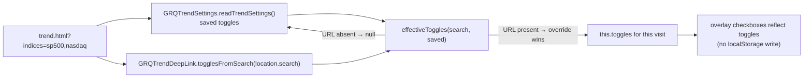

# feat: `?indices=` deep-link for Trend-view benchmark indices (visit-only)

## Summary

Adds a transient `?indices=` deep-link to the **Prediction Trend** view
(`docs/trend.html`), part of milestone #450 (URL parameters for more dashboard
state). `trend.html?indices=sp500,nasdaq,russell2000` turns the listed benchmark
indices **ON** for that visit; any index not listed is **OFF**. Keys are the
canonical overlay keys (`sp500`, `nasdaq`, `russell2000`); unknown keys are
ignored and an **absent** param leaves the saved/default toggles unchanged.

Precedence mirrors the existing `?theme=` / `?view=` transient-override model:
the URL value wins over the saved `grq.trend.indices` choice for this visit but
is **never persisted** to `localStorage`, and is read on page load only
(one-way). Reloading without the param returns to the saved choice.

Closes #480

### Design

- **New pure helper** `docs/trend_indices_deeplink.js`
  (`globalThis.GRQTrendDeepLink`), a classic ``
  (HTTP 200 when served from `docs/`).
- Manual expectation: `trend.html?indices=sp500,nasdaq` shows only the S&P 500
  and NASDAQ overlays for that visit; reloading without the param restores the
  saved choice; no `localStorage` writes occur on load.

## Test Plan

- **New** `tests/trend_indices_deeplink_test.ts` (17 cases) covering:
  - valid input — single / multiple / all keys, trimming + case-insensitivity,
    no leading `?`;
  - invalid input — unknown keys ignored, only-unknown and present-but-empty
    values yield an all-off map;
  - absent input — missing param / empty search return `null`;
  - `effectiveToggles` precedence — URL wins, absent falls back to (and
    normalises) the saved map, present-but-empty overrides to all-off, never
    mutates the saved argument, always returns a full map.
- **Updated** `tests/trend_view_wiring_test.ts` — pins `trend_indices_deeplink.js`
  in both the `trend.html` script list and the `sw.js` precache list.
- **Updated** `tests/js_syntax_test.ts` — parses the new production script.
- Full suite: `deno test --allow-read tests/*.ts` → 836 passed, 0 failed;
  `deno fmt --check`, `deno lint`, `deno check` all clean.
