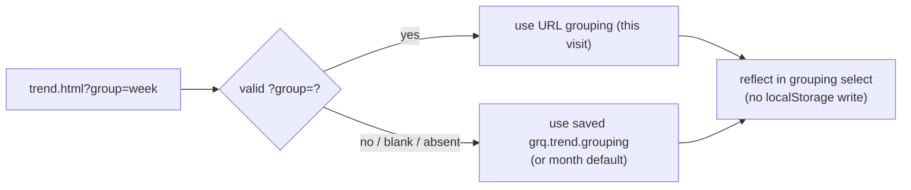

## Summary

Adds a transient `?group=day|week|month|quarter` deep-link to the **Prediction
Trend** view (`docs/trend.html` / `docs/trend.js`), mirroring the existing
`?theme=` transient-override model. A valid grouping in the URL overrides the
saved `grq.trend.grouping` choice **for the current page load only** — it is
read once on load (one-way), reflected in the grouping control, and **never**
persisted to `localStorage`. Unknown / blank / absent values leave the
saved/default grouping unchanged. Closes #481.

Part of milestone #450 (URL parameters for more dashboard state).

### What changed
- **New `docs/trend_grouping_link.js`** — a pure, DOM-free classic `<script>`
  (published on `globalThis.GRQTrendGroupingLink`, importable by Deno tests),
  beside the existing trend settings. It exposes:
  - `groupingFromSearch(search)` — returns a valid granularity or `null`,
    reusing `GRQTrendSettings.GRANULARITIES` as the single source of truth for
    what counts as a granularity.
  - `effectiveGrouping(search, savedGrouping)` — a valid `?group=` override
    wins; otherwise the saved grouping stands (normalised to the `month`
    default via `GRQTrendSettings.normaliseGrouping`). Mirrors
    `GRQChartWindow.effectiveWindowDays`.
- **`docs/trend.js`** — boot now applies `effectiveGrouping(location.search, …)`
  beside `readTrendSettings()`. The override flows into the grouping `<select>`
  through the existing `buildGroupingControl()` (which only writes storage on a
  user change), so the URL override is reflected **without** any storage write.
- **`docs/trend.html`** / **`docs/sw.js`** — load and precache the new script.

### Precedence (visit-only, never persisted)



## Evidence

Playwright MCP was unavailable in this run, so the behaviour was verified
headlessly against the **real** shipped helpers mounted in a `deno-dom`
document — proving the end-to-end wiring (`?group=week` → grouping select),
not just the pure functions:

```
saved grouping       : month
?group=week effective: week
select.value         : week
localStorage writes  : 0 []
```

This demonstrates each acceptance criterion: `?group=week` groups by week for
the visit, the grouping control reflects it, and **no** `localStorage` write
occurs (so a reload without the param returns to the saved grouping).

## Test Plan

New `tests/trend_grouping_link_test.ts` (all passing; full suite: 825 passed):

- `groupingFromSearch` extracts each valid granularity (`day`/`week`/`month`/
  `quarter`), with/without a leading `?` and alongside other params.
- `groupingFromSearch` returns `null` for absent, blank (`?group=`), whitespace,
  and unknown (`?group=year`) values, plus `null`/`undefined` input.
- `effectiveGrouping` — valid override wins over the saved grouping; absent/
  invalid override keeps the saved grouping; a corrupt saved grouping falls back
  to the `month` default.
- Wiring guard — `trend.html` loads and `sw.js` precaches
  `trend_grouping_link.js`.
