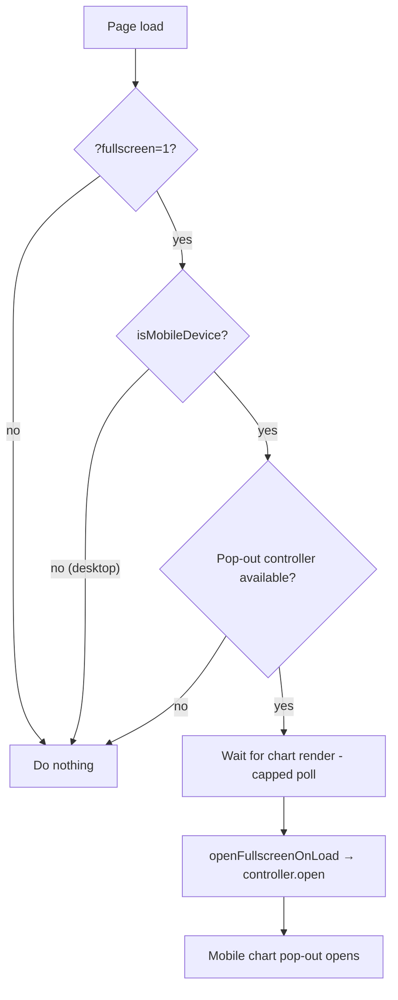

## Summary

Adds a transient `?fullscreen=1` URL parameter that, on **mobile**, opens the
existing performance-chart pop-out (#451) on page load. It is a **no-op on
desktop** (which has ample chart space) and **visit-only** — read once on load,
never persisted to `localStorage` — mirroring `?theme=`. This is part of the
URL-parameters-for-dashboard-state milestone (#450); it only *opens* the
existing pop-out and does not restyle it.

Closes #482.

### What changed

- **`docs/chart_popout.js`** — three pure (no-DOM) helpers published on
  `globalThis.GRQChartPopout`:
  - `fullscreenRequested(search)` — truthy only for the exact value `1`;
    degrades to `false` on malformed input.
  - `shouldOpenFullscreen({ search, isMobile, popout })` — the boot decision:
    every gate must pass (param present, mobile, controller available, not
    already open). Desktop (`isMobile` false) always returns `false`.
  - `openFullscreenOnLoad(opts)` — opens via the controller when the gates
    pass; a silent no-op otherwise.
- **`docs/app.js`** — boot wiring now captures the pop-out controller returned
  by `createChartPopout()` and, on mobile with `?fullscreen=1`, opens it once
  the chart has rendered (a capped poll so a never-loading page can't poll
  forever). Reuses the existing `isMobileDevice()` gate. Degrades cleanly when
  `GRQChartPopout` / the controller is absent.
- **`README.md`** — documents the new deep-link parameter.

### Flow

## Evidence

On mobile (390×844), `index.html?fullscreen=1` opens the chart pop-out on load
(full-viewport landscape chart, #452 presentation):

On desktop (1400×900) the same URL is a no-op — the normal inline dashboard
loads with no overlay:

Screenshots captured with headless Chrome against a local static server of
`docs/`.

## Test Plan

New `tests/chart_fullscreen_test.ts` (16 cases) exercises the real shipped
helpers headlessly via a fake pop-out controller:

- `fullscreenRequested` — `=1` true; `=0`/`=2`/`=true`/empty/absent false;
  null/undefined degrade to false.
- `shouldOpenFullscreen` — true on mobile + param + closed pop-out; **false on
  desktop** even with the param; false without the param; false when already
  open; false when the controller is absent.
- `openFullscreenOnLoad` — opens (calls `open()` exactly once) on mobile;
  **never calls `open()` on desktop**; no-op without the param; no-op without a
  controller.

All existing `tests/chart_popout_test.ts` cases continue to pass. (Two
unrelated failures in `tests/trend_view_wiring_test.ts` pre-exist on the
milestone base branch and are untouched by this change.)
