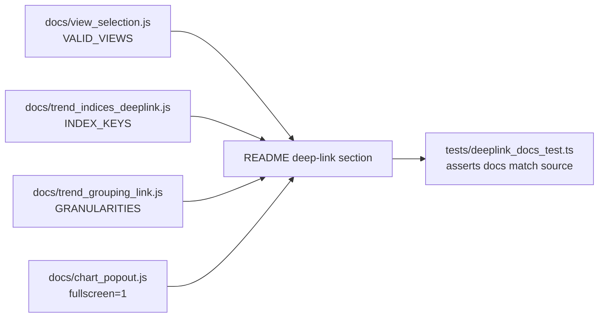

## Summary

Documentation-only change extending the README's **Deep-link URL parameters**
section to cover the four parameters added under milestone #450 (URL parameters
for more dashboard state), so the docs match shipped behaviour. Closes #483.

Added documentation for:

- `?view=portfolio|trend` (#479) — deep-link to a top-level view; routes between
  `index.html` and `trend.html`; transient/visit-only, never persisted.
- `?indices=sp500,nasdaq,russell2000` (#480) — Trend view: listed benchmark
  overlays on, the rest off; unknown keys ignored; empty value turns all off;
  visit-only, never persisted.
- `?group=day|week|month|quarter` (#481) — Trend **Group by** granularity;
  visit-only; absent/invalid falls back to the saved choice, then the **month**
  default.
- `?fullscreen=1` (#482) — **mobile-only**, opens the landscape pop-out on load;
  **no-op on desktop**; visit-only.

Also updated the lead-in count ("reads **nine** optional query parameters") and
added a **Worked examples** list, including the canonical combined example
`?date=2026-01-01&window=180&fullscreen=1` and a Trend example
`trend.html?group=week&indices=sp500,nasdaq`.

The allowed values, fallback behaviour and transient/visit-only semantics were
taken directly from the shipped scripts (`docs/view_selection.js`,
`docs/trend_indices_deeplink.js`, `docs/trend_grouping_link.js`,
`docs/chart_popout.js`) so the prose matches actual behaviour.

## Evidence

This is a documentation/CLI-only change with no web UI to screenshot. It is
verified by the new tests below, which tie the documented parameter keys to the
values shipped in `docs/*.js`.

## Test Plan

Added `tests/deeplink_docs_test.ts` (6 tests, all passing):

- `?view=` values documented match `VALID_VIEWS` in `view_selection.js`.
- `?indices=` overlay keys (`sp500`, `nasdaq`, `russell2000`) are documented.
- `?group=` granularities (`day`/`week`/`month`/`quarter`) are documented.
- `?fullscreen=1` is documented as mobile-only / no-op on desktop.
- The canonical combined and Trend worked examples are present.
- The lead-in count word matches the number of documented `?param=` bullets.

The new tests were confirmed to fail against the pre-change README (5 of 6 fail)
and pass after the change, acting as a regression guard against doc drift.

### Pre-existing unrelated failures

`./quality.sh` reports two failures in `tests/trend_view_wiring_test.ts`
(`trend.html` not loading and `sw.js` not precaching `trend_indices_deeplink.js`).
These pre-exist on the milestone base branch
(`milestone/450-feat-url-parameters-for-more-dashboard-state-c`) — the `?indices=`
wiring sub-issue (#480) has not yet landed its `trend.html`/`sw.js` wiring — and
are unrelated to this documentation-only change. They are out of scope for #483
and were not introduced here.
