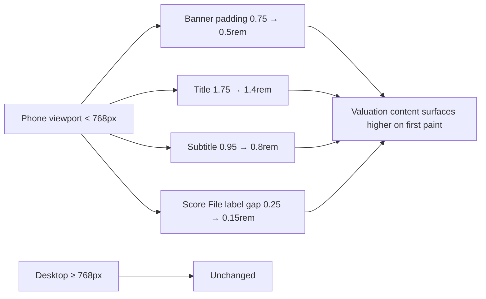

# Mobile: reclaim vertical space in dashboard header, subtitle & Score File chrome

## Summary

On a phone the GRQ Validation Dashboard's top-of-page chrome (gradient
banner, oversized title, lead subtitle and the Score File row) consumed a
large slice of the first screen before any valuation data was visible.
Issue #315 already shrank the banner on phones; this change pushes the four
top-of-page targets tighter still so the valuation content surfaces higher
on first paint. All overrides stay gated behind the existing
`@media (max-width: 768px)` mobile breakpoint, so desktop/tablet (>=768px)
rendering is unchanged. Closes #492.

Changes in `docs/styles.css` (mobile block only):

| Target | Before (#315) | After (#492) |
| --- | --- | --- |
| `.card-header.header-gradient` padding | 0.75rem | 0.5rem |
| `.header-gradient .display-4` title | 1.75rem | 1.4rem |
| `.header-gradient .lead` subtitle | 0.95rem | 0.8rem (+ tighter line-height) |
| `.form-label` margin-bottom (Score File) | 0.25rem | 0.15rem |

No HTML was changed: the title stays an `<h1>`, the lead subtitle, theme
toggle and the labelled `#scoreFileSelect` control all remain, so there is
no accessibility regression and the pa11y WCAG2AA gate still applies.

## Evidence

Captured at a 390px-wide phone viewport via headless Chromium. The tighter
banner lets the title sit on one line and lifts the Market Performance
Comparison section into the first screen.

Before (#315 baseline) | After (#492)
:---:|:---:
 | 

## Test Plan

- Added `tests/header_chrome_compact_mobile_test.ts` — pins each of the four
  tightened values below its #315 baseline, asserts the overrides stay
  confined to the mobile media block (desktop unchanged), and confirms the
  `<h1>`, lead subtitle, theme toggle and labelled Score File control all
  remain in `index.html`. These tests fail against the #315 CSS and pass
  after the change.
- Existing `tests/header_banner_mobile_test.ts` and
  `tests/dashboard_section_spacing_mobile_test.ts` continue to pass.
- Full Deno suite: `deno test --allow-read tests/*.ts` — 847 passed, 0 failed.
- `deno fmt --check`, `deno lint` and `deno check` clean.
