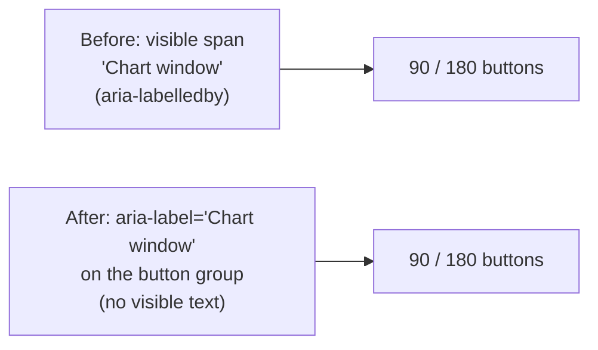

# Mobile: remove redundant visible "Chart window" label

## Summary

The 90/180-day chart-window toggle was preceded by a visible "Chart window"
text label that added chrome without meaning — the two buttons (90 / 180) are
self-explanatory, and on mobile the label wasted a premium row of vertical
space. This change removes the **visible** label while keeping the toggle fully
functional and accessible.

- `docs/index.html`: dropped the `Chart window` and moved the group's accessible
  name onto the control itself via `aria-label="Chart window"` (replacing the
  previous `aria-labelledby="chartWindowLabel"`). The radio group, both 90/180
  inputs, and their wiring (`#chartWindowControl`) are unchanged.
- `docs/styles.css`: removed the now-unused `.chart-window-control-label` rule.
- `tests/chart_window_toggle_test.ts`: updated the accessibility assertion to
  expect the `aria-label` name, and added two regression tests pinning that the
  visible label span/class and its CSS rule are gone.

No visible "Chart window" text renders on any device; the button group retains
an accessible name so the pa11y WCAG2AA gate still passes.

Part of #484 (item 2). Closes #493.

## Evidence

Mobile-width (420px) render — the 90/180 toggle sits directly under the stock
heading with no "Chart window" label above it:

Accessibility: the toggle's accessible name now comes from `aria-label`, so the
`role="group"` control is still announced as "Chart window". `pa11y-ci`
reports no new errors for this control — the only remaining failures are
pre-existing dark-mode contrast warnings on `#trendViewLink` (the Prediction
Trend button), which this change does not touch.

## Test Plan

- `deno test --allow-read tests/chart_window_toggle_test.ts` — 13 tests pass,
  including the updated accessibility test and the new:
  - `index.html: the visible 'Chart window' label is removed (issue #493)`
  - `styles.css: the unused label rule is removed (issue #493)`
- Full suite: `deno test --allow-read tests/*.ts` — 849 tests pass.
- `./quality.sh` — passes cleanly (cargo fmt/clippy/check/test/build, deno
  fmt/lint/check/test).
