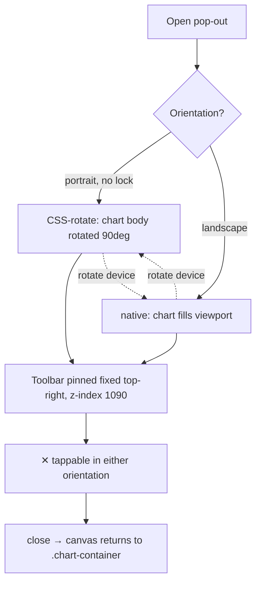

# Fix mobile chart pop-out — keep open across rotation & make ✕ close work in landscape

## Summary

The mobile chart pop-out (`#chartPopout`) uses a pure-CSS rotation fallback for
its landscape look on iOS, where `screen.orientation.lock()` is unavailable. In
that portrait media block the chart body (`.chart-popout-body`) is
`position: absolute` and rotated 90°, so it visually covers the whole viewport
and removes the toolbar from the flex flow. With the old
`position: relative; z-index: 1` the ✕ close affordance could be stranded behind
the rotated coordinate space and become unreachable.

The fix pins the close toolbar to the physical top-right of the viewport with
`position: fixed` and `z-index: 1090` (above the overlay's own `1080` and the
rotated body), so the ✕ stays upright and tappable no matter how the chart is
rotated underneath. The pop-out's existing JS lifecycle already keeps the
overlay open across an orientation change and restores the single shared
Chart.js canvas to its inline `.chart-container` on close; this is now locked in
with regression tests covering the landscape close path.

`Closes #494`

### Changes
- `docs/styles.css` — in the portrait (`css-rotate`) media block, pin
  `.chart-popout-toolbar` (`position: fixed; top: 0; right: 0; z-index: 1090;`)
  so the ✕ floats above the rotated chart and stays reachable.
- `tests/chart_popout_landscape_close_test.ts` — new tests for the landscape
  close path and cross-rotation persistence.

## Evidence

This is a CSS-positioning fix inside a mobile-only, rotated overlay. Playwright
MCP was unavailable in this run, so verification is via headless Deno tests that
drive the **real** shipped wiring (`createChartPopout`) plus an inspection of the
shipped `docs/styles.css` portrait media block.

Acceptance criteria covered:
- Open in portrait, rotate to landscape → pop-out stays open AND ✕ closes it —
  `createChartPopout - stays open across rotation and ✕ then closes it`.
- Open in landscape directly → ✕ closes it —
  `createChartPopout - ✕ closes the pop-out opened in landscape`.
- Canvas returns to its inline `.chart-container` on close regardless of the
  orientation closed in — asserted in both tests above.
- Close affordance stays reachable in the rotated frame —
  `styles.css - close toolbar is pinned above the rotated chart in portrait`.

## Test Plan

New file `tests/chart_popout_landscape_close_test.ts`:
- `createChartPopout - ✕ closes the pop-out opened in landscape` — opens with a
  landscape viewport, closes via the controller's close path (the ✕ handler),
  asserts the overlay hides and the canvas returns to its container.
- `createChartPopout - stays open across rotation and ✕ then closes it` — opens
  in portrait (iOS css-rotate path), dispatches `orientationchange`/`resize`,
  asserts the pop-out stays open, then closes and asserts the canvas returns.
- `styles.css - close toolbar is pinned above the rotated chart in portrait` —
  asserts the portrait media block pins the toolbar (`fixed`/`absolute`) with a
  `z-index >= 1080` so the ✕ is not stranded behind the rotated body.

All 852 Deno tests pass (`deno test --allow-read tests/*.ts`); `deno fmt`,
`deno lint`, and `deno check` are clean.
