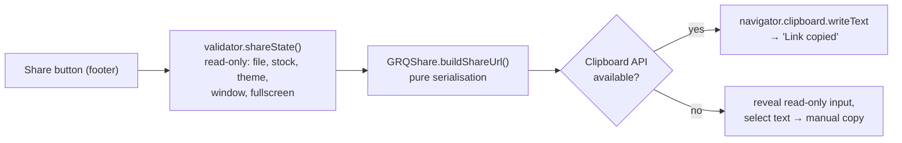

# Footer "Share" deep-link button (Issue #495)

## Summary

Added a small, low-prominence **🔗 Share** control to the page footer of
`docs/index.html` (there was no `<footer>` before) that builds an absolute URL
encoding the user's current selections and copies it to the clipboard with a
brief confirmation. It is **read-only** — generating/copying a link never
mutates saved/localStorage settings — and degrades gracefully to a
select-the-text fallback where the async Clipboard API is unavailable.

This is the inverse of the dashboard's existing deep-link parameters: it reuses
the same params the app already reads on load rather than re-implementing any
parsing.

- `?file` / `?date` (score file) — `docs/app.js`, `docs/date_selection.js`
- `?stock` — `docs/stock_selection.js`
- `?theme` — `docs/theme.js` (emitted only for a forced light/dark mode; `auto`
  is the default and so is left implicit)
- `?window` (90/180) — `docs/chart_window_settings.js`
- optional `?view` / `?indices` / `?group` — emitted only when supplied
  (forward-compatible with sibling docs issue #483)
- transient `?fullscreen=1` (#482) — emitted only while the mobile chart
  pop-out owns the canvas

Closes #495.

## Design

The serialisation lives in pure helpers (`buildShareQuery` / `buildShareUrl`)
with no DOM, so they are driven headless by the Deno tests. The DOM wiring
(footer button, clipboard, fallback) is skipped when there is no `document`,
mirroring `docs/theme.js`.

## Evidence

Footer Share control rendered on the dashboard (headless Chrome, dark theme):

Accessibility: the control is a native `<button>` with a visible "Share" label
and an `aria-label`, the confirmation uses a `role="status"`/`aria-live="polite"`
region, and the fallback input carries an `aria-label`. The existing pa11y
WCAG2AA gate continues to cover the dashboard.

## Test Plan

- Added `tests/share_link_test.ts` exercising the real shipped helpers from
  `docs/share_link.js`:
  - `buildShareQuery` per-param serialisation: `?file` (and `file` winning over
    `date`), `?date`, `?stock`, `?theme` (light/dark only, `auto`/unknown
    dropped), `?window` (90/180 only, disallowed dropped), `?view`/`?indices`/
    `?group` (only when provided), `?fullscreen=1`, stable composition order,
    and empty/garbage state.
  - `buildShareUrl` absolute-URL assembly: appends the query, replaces an
    existing query/hash, returns the bare URL when there is nothing to share,
    and reproduces a full real-world selection.
- Full Deno suite (`deno test --allow-read tests/*.ts`) passes (867 tests);
  `deno fmt --check`, `deno lint` clean.

## Read-only / scope notes

- `shareState()` only reads live state (selected file/stock, applied `<body>`
  theme class, current window, pop-out flag) — it never writes localStorage.
- Documenting the params themselves is tracked by #483; URL-shortening /
  server-side state is out of scope.
