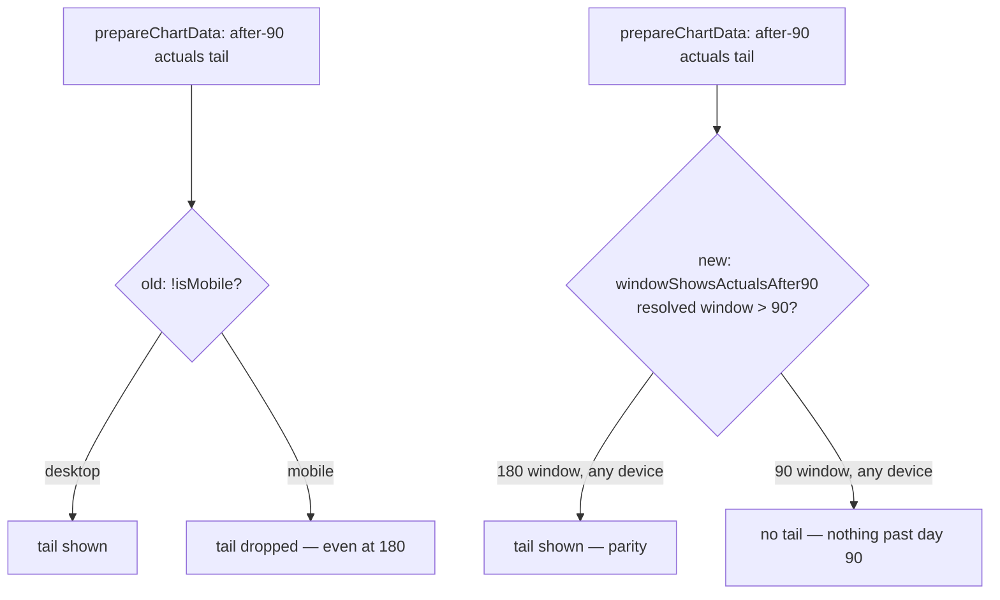

# fix: mobile — restore actuals series in the 180-day chart window (desktop parity)

## Summary

On mobile, switching the main "Portfolio Performance Over Time" chart to the
180-day window dropped the **actuals** series, while the same 180-day view
rendered actuals correctly on desktop — a mobile-only regression
(part of #484, item 5). `Closes #496`.

**Root cause.** The chart splits the actuals into two datasets: an `"Actual"`
series (the first 90 days) and an `"Actual (After 90 Days)"` tail
(day 90 → window end). That tail was gated on `!isMobile` in both the
single-stock and portfolio branches of `prepareChartData`. When #464 relaxed
the old desktop-180 lock so mobile could opt into the 180-day window, the guard
silently dropped every actuals point between day 90 and day 180 on mobile — so
the mobile 180-day view showed no actuals tail while desktop did.

**Fix.** The after-90 tail is a property of the *window*, not the *device*: it
belongs in the chart whenever the resolved visible window runs past day 90.
Added a shared kernel in `docs/projection.js`:

```js
function windowShowsActualsAfter90(isMobile, windowDays) {
    return deviceWindowDays(isMobile, windowDays) > MOBILE_WINDOW_DAYS;
}
```

`docs/app.js` now gates both the single-stock and portfolio after-90 datasets on
`GRQProjection.windowShowsActualsAfter90(isMobile, windowDays)` instead of
`!isMobile`. Because the predicate is derived from the same `deviceWindowDays`
resolver the chart and Market Performance summary already share (#367), the two
devices stay in parity and cannot drift:

- mobile 90 → no tail (unchanged), mobile 180 → tail restored (the fix);
- desktop 180 → tail (unchanged), desktop 90 opt-in → no tail (unchanged).



## Evidence

Mobile viewport (390px wide → `xs` breakpoint), 180-day window selected, matured
score date `2025-12-17`.

Before — legend has no "Actual (After 90 Days)" and the actuals tail is missing:


After — the "Actual (After 90 Days)" series renders across the full window,
matching the desktop 180-day view:


## Test Plan

Added `tests/chart_actuals_window_test.ts`, which exercises the real shipped
`GRQProjection.windowShowsActualsAfter90` kernel (the exact decision the chart
makes):

- mobile 180-day window shows the after-90 tail (the regression);
- mobile 90-day window (and mobile default) omit it (unchanged);
- desktop views unchanged (180 shows, 90 opt-in omits);
- mobile and desktop agree for the same window (parity);
- a bad stored window falls back to the device default;
- the predicate tracks `deviceWindowDays` (tail iff resolved window > 90).

All 873 Deno tests pass (`deno test --allow-read tests/`); `deno fmt --check`,
`deno lint`, and `deno check` are clean. No Rust code was changed.
