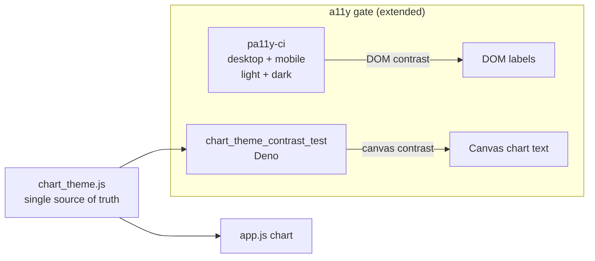

# Dark mode: readable chart labels + a11y gate extended to mobile/canvas contrast

## Summary

Some chart labels were unreadable in dark mode and the existing accessibility
gate (pa11y-ci) never caught it. This PR does both halves the issue asks for —
fixes the contrast and closes the CI gap that let it through. **Closes #497.**

Root cause of the unreadable labels: the **main dashboard chart** in
`docs/app.js` painted its title with a hard-coded `color: '#333'` and left the
axis titles, tick labels and legend at Chart.js' default grey (`#666`). Those
are drawn on the `<canvas>`, so on the dark card background they were dark-on-
dark — and, being canvas pixels, completely invisible to the DOM-based pa11y
gate. (`docs/trend.js` already themed its chart correctly; only `app.js` was
broken.)

### Part A — Fix the contrast

- New `docs/chart_theme.js` — a pure `globalThis.GRQChartTheme` module (same
  style as `color_key.js` / `series_label_colour.js`) that is the single source
  of truth for the themed canvas text/grid colours, tuned to clear WCAG 2.1 AA
  (≥ 4.5:1) against the chart's card background in each theme.
- `docs/app.js` now derives the chart's canvas text colour from
  `GRQChartTheme.chartTheme(detectTheme())` and applies it to the title, axis
  titles, tick labels and grid lines. A root-level `options.color` feeds the
  desktop legend (which renders from Chart.js defaults) the AA colour too.
- Wired `chart_theme.js` into `docs/index.html` and the service-worker precache
  (`docs/sw.js`); bumped `APP_VERSION` to `1.0.217` across `sw.js`,
  `sw-register.js`, `index.html` and `trend.html` so the new asset is fetched.

### Part B — Close the CI gap

Two reasons the DOM gate missed it, each now covered:

1. **Desktop-only viewport** — added phone-width (390×844) entries to
   `pa11yci.json` for `index.html`/`trend.html` in both light and dark, so
   mobile chrome is contrast-checked.
2. **Canvas text is invisible to pa11y/axe** — added
   `tests/chart_theme_contrast_test.ts`, which asserts the themed chart
   colours meet AA at the source of truth. Re-introducing a low-contrast
   colour (mobile or canvas) now fails CI.

## Evidence

Dark mode, mobile (390px), single-stock view — the y-axis labels, axis title
and legend go from dark-on-dark to readable:

| Before | After |
| --- | --- |
|  |  |

## Test Plan

- **`tests/chart_theme_contrast_test.ts`** (new) — themed canvas text meets AA
  on the light and dark card backgrounds; unknown theme falls back to the light
  palette; `app.js` is wired to `GRQChartTheme`; and a regression case proving
  the pre-fix `#333` title **fails** AA on the dark card.
- **`tests/pa11y_config_test.ts`** (extended) — `pa11yci.json` includes a
  phone-class viewport entry, in both the light and dark themes.
- **`tests/js_syntax_test.ts`** (extended) — `docs/chart_theme.js` parses
  cleanly.
- Full suite: `deno test --allow-read tests/*.ts` → 935 passed, 0 failed.
- `deno fmt --check`, `deno lint`, `deno check` all clean.
