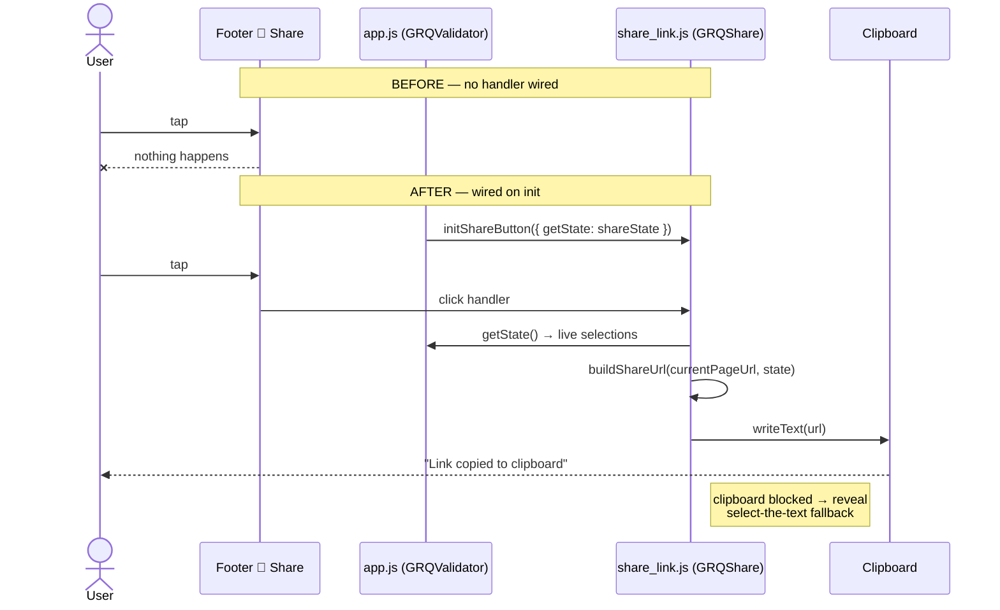

# PR Summary — Issue #515

## Summary

The footer **🔗 Share** button did nothing when tapped — no clipboard copy, no
"Link copied to clipboard" confirmation. The deep-link builder, clipboard write,
and select-the-text fallback all shipped in `docs/share_link.js` (Issue #495),
and the dashboard already exposed the live selections via
`GRQValidator.shareState()`. The missing piece was the wiring: `docs/app.js`
never called `GRQShare.initShareButton(...)`, so the button had **no click
handler**.

This PR adds a small `initShareButton()` method to `GRQValidator` and calls it
from `initializeEventListeners()`, feeding the live selections to the existing
builder via `getState: () => this.shareState()`. The call is guarded so a missing
helper degrades cleanly (the footer simply stays inert) and remains read-only —
sharing never mutates saved settings. The existing select-the-text fallback for
blocked-clipboard contexts is preserved.

Closes #515.

## Mermaid — before vs after

## Evidence

Playwright MCP browser tools were not available in this environment, so a live
screenshot could not be captured. The behaviour is covered by an automated
behavioural test that drives the **real** DOM-wiring in `docs/share_link.js`
with a fake document: a tap reads `getState()`, builds the deep-link URL, and
surfaces it (via the fallback path, since the headless test has no Clipboard
API), flashing a status message. A companion assertion pins that `docs/app.js`
invokes `GRQShare.initShareButton` and feeds it `shareState()`.

The wiring assertion was confirmed to **fail before** the `app.js` change
(reproducing the reported bug) and **pass after** it. Full Deno suite: 939
tests passing.

## Test Plan

- Added `tests/share_button_wiring_test.ts`:
  - `share_link.js publishes the DOM-wiring entry point` — `initShareButton` is
    published once a document exists.
  - `a tap reads getState and surfaces the deep-link (fallback path)` — clicking
    the footer button reads the live selections and writes the encoded deep-link
    (`file`, `stock`, `window`) into the fallback control with a status message.
    Reproduces the user-facing flow.
  - `initShareButton is inert when the footer button is absent` — no throw when
    the control is missing.
  - `app.js wires the footer Share button to shareState (issue #515)` — pins the
    `GRQShare.initShareButton` + `shareState()` wiring in `docs/app.js` (which
    bootstraps a live `new GRQValidator()` at import and cannot be imported
    headless — mirrors the source-structure checks in
    `chart_window_toggle_test.ts`). This test fails on the unfixed `app.js`.
- Existing `tests/share_link_test.ts` (pure builder helpers) continues to pass.
- `deno fmt --check`, `deno lint`, `deno check`, and the full `deno test` suite
  (939 passing) all green.

## Files changed

- `docs/app.js` — add `initShareButton()` and call it from
  `initializeEventListeners()`.
- `tests/share_button_wiring_test.ts` — new behavioural + wiring tests.
- `CHANGELOG.md` — note the fix under a new **Fixed** section.
