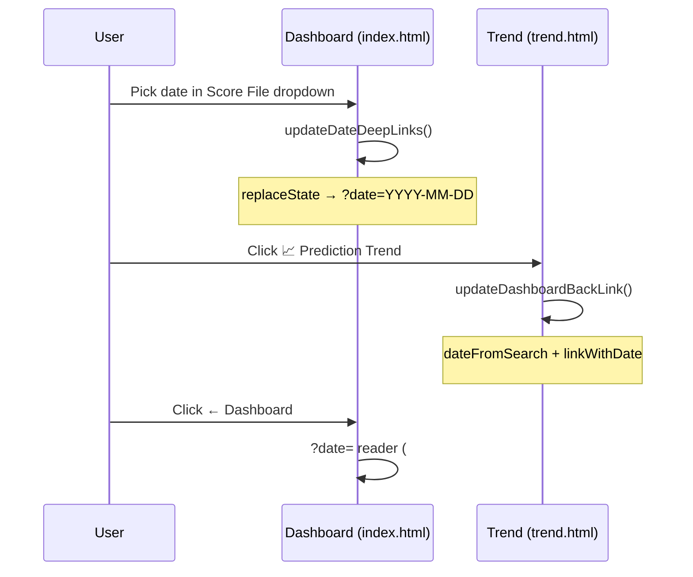

## Summary

The dashboard lost the chosen **Score File** date when you opened **📈 Prediction
Trend** and clicked **← Dashboard** to return: both links were static
(`href="trend.html"` / `href="index.html"`), so the dashboard reloaded on its
default date (nearest score on or before 90 days ago) instead of the date you
had selected.

This change routes the selected date through the URL, reusing the existing
`?date=` reader (#436) and the date deep-link module (`docs/date_selection.js`):

- Picking a date in the **Score File** dropdown now writes
  `?date=YYYY-MM-DD` into the dashboard URL (via `history.replaceState`), so a
  **refresh** and **copied/shared links** reopen on that exact date.
- The date is forwarded onto the **📈 Prediction Trend** link, and the Trend
  page rebuilds its **← Dashboard** link as `index.html?date=YYYY-MM-DD`, so
  returning restores the **exact** selected date.
- The Prediction Trend page stays **independent** of the date — it reads
  `?date=` *only* to build its return link, never to choose what it displays
  (no date → the link stays the plain `index.html`).

New pure helpers in `docs/date_selection.js`:

- `dateForFile(scores, file)` — map a selected file path back to its
  `YYYY-MM-DD` date.
- `searchWithDate(search, date)` — set `?date=` on the dashboard's own URL and
  drop any stale `?file=` (the loader resolves `?file=` before `?date=`),
  preserving other params.
- `linkWithDate(base, date)` — build a `…?date=` navigation href, returning the
  base unchanged when no/invalid date is supplied.

Closes #517.

## Evidence

`headless: 'shell'` Puppeteer drive against a local server confirmed the whole
round trip (the live chart page stalls the default headless screenshot path, so
the shell renderer was used):

```
1. dashboard URL after select: http://localhost:8765/index.html?date=2025-12-11
2. trend link href:            trend.html?date=2025-12-11
3. trend back link href:       index.html?date=2025-12-11
   dashboard dropdown (?date=2025-12-11 reload): 2025/December/11.tsv
```

Dashboard with the chosen date selected and mirrored into the URL:


Prediction Trend page — its **← Dashboard** link carries the date back
(`index.html?date=2025-12-11`) while the chart itself is unchanged by the date:


### Data flow



## Test Plan

- `tests/date_selection_test.ts` — added unit tests for `dateForFile`,
  `searchWithDate` (sets `date`, drops `file`, preserves other params, invalid
  date no-op) and `linkWithDate` (append / replace / hash / invalid-date
  passthrough).
- `tests/date_url_roundtrip_test.ts` — new end-to-end test driving the real
  helpers through the full chain (dropdown → URL → Trend link → back link →
  reload re-selects the same file), an independence check (no date → plain
  link), plus thin-wiring assertions against `docs/app.js`, `docs/trend.js`,
  `docs/index.html` and `docs/trend.html`.
- Full suite green: `deno test --allow-read tests/*.ts` → 963 passed;
  `deno fmt`, `deno lint`, `deno check` all clean.
