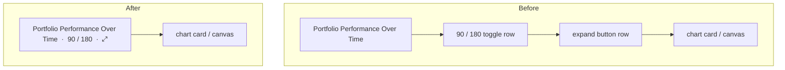

## Summary

The reporter asked repeatedly (their words: "asked three times") for the chart
control buttons to be **moved**. The 90/180-day window toggle
(`#chartWindowControl`) and the expand ⤢ button (`#chartPopoutExpand`) were
still **stacked on two separate rows below** the "Portfolio Performance Over
Time" heading, inside the chart card — the earlier consolidation was never
delivered.

This PR moves both controls **up onto the chart heading row**, on a **single
horizontal line** to the right of `#chartTitle`, above the chart card:

- On **desktop** the toggle sits inline with the heading (the expand button
  stays hidden on desktop, as before).
- On **mobile** the 90/180 toggle and the expand ⤢ button now share **one** row
  (previously two), reclaiming the wasted second row of vertical space.

Only layout/markup moved — the toggle wiring, the pop-out behaviour (bound by
`#chartPopoutExpand` id, unaffected by the move), accessibility (`role="group"`,
`aria-label`, label associations) and the `← Back to Portfolio View` button are
unchanged.

Closes #518.

## Evidence

Mobile width (375–400px) — the two controls now sit together on one row,
lifted above the chart card:

Desktop — the toggle rides inline with the heading; the mobile-only expand
button is hidden:

Layout before → after:

## Test Plan

- Added `tests/chart_controls_heading_row_test.ts` (issue #518):
  - controls now appear **after** `#chartTitle` and **before** the chart card /
    `#performanceChart` canvas (moved up, out of the card);
  - both controls share one `.chart-heading-controls` wrapper, toggle before
    the expand button;
  - `.chart-heading-controls` is a flex row (one horizontal line);
  - the stacked `chart-window-control mb-2` second-row margin is gone.
- Existing related suites still pass: `chart_window_toggle_test.ts`,
  `chart_popout_test.ts`, `chart_landscape_test.ts`,
  `chart_popout_landscape_close_test.ts`,
  `dashboard_section_spacing_mobile_test.ts`.
- Full `./quality.sh` passes (cargo fmt/clippy/check/test + `deno fmt`,
  `deno lint`, `deno check`, `deno test` — 943 Deno tests green).
