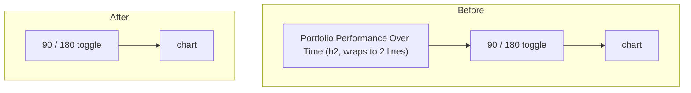

## Summary

The dashboard's portfolio (aggregate) view showed a large **"Portfolio
Performance Over Time"** heading — rendered both as the HTML `<h2 id="chartTitle">`
above the chart card **and** as the Chart.js canvas title. On a phone it wrapped
onto two lines and simply wasted vertical space (the reporter scribbled it out in
the issue screenshot).

This PR removes that heading **for the portfolio view only**:

- A new pure helper `docs/chart_title.js` (`GRQChartTitle.chartTitle`) resolves
  the heading text. It returns `""` for the portfolio/aggregate view, so
  `renderChart()` hides the HTML `#chartTitle` element (`display:none`) and the
  canvas title (`display:false`) — no row is reserved and no chart space is
  spent.
- The **stock-specific** title (`Stock Performance: <ticker> (Score: …,
  Target: $…)`) is unchanged — the reporter did not ask to remove it, and it
  carries useful context.

The helper is a classic script published on `globalThis` (mirroring
`docs/projection.js`), so the browser dashboard and the Deno tests run the exact
same code. It is registered in `docs/index.html` (before `app.js`) and added to
the service-worker precache list in `docs/sw.js`.

Behaviour before → after:

Closes #519.

## Evidence

Mobile (390px) portfolio view — the "Portfolio Performance Over Time" heading is
gone and the chart sits directly under the 90/180 toggle, reclaiming the wasted
two-line heading row:

Runtime confirmation (rendered via the committed dashboard against local score
data for 2026-01-01):

- Portfolio view: `#chartTitle` → `text=""`, `display:none`.
- Stock view (`?stock=NASDAQ:SBLK`): `#chartTitle` →
  `"Stock Performance: NASDAQ:SBLK (Score: 1.000, Target: $29.67)"`,
  `display:block` (unchanged).

## Test Plan

- Added `tests/chart_title_test.ts` exercising the real shipped helper
  (`GRQChartTitle.chartTitle`):
  - portfolio view (null / empty / missing `selectedStock`, no argument) → `""`
    (the regression for #519);
  - stock view with data → full `Stock Performance: … (Score: …, Target: $…)`;
  - stock view without data (and partial stock missing `target`) → bare
    `Stock Performance: <ticker>`;
  - score/target formatted to fixed precision (3 dp / 2 dp).
- Full Deno suite green: `deno test --allow-read tests/*.ts` → 947 passed.
- `deno fmt --check`, `deno lint`, `deno check` clean; `cargo check` clean (no
  Rust changes).
