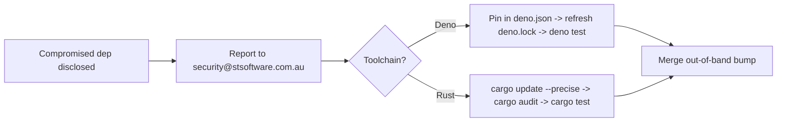

# PR Summary — SCR-RUNBOOK: add SECURITY.md

## Summary

The repository had no `SECURITY.md`, so there was no published disclosure
contact and no written emergency-bump procedure for responding to a
compromised dependency of this Rust + Deno project. This PR adds a short
root `SECURITY.md` that closes the SCR-RUNBOOK posture/readiness gap:

- A disclosure contact — **security@stsoftware.com.au** — plus a pointer to
  GitHub private vulnerability reporting.
- A one-section emergency dependency-bump procedure naming the exact
  commands for each toolchain:
  - **Deno (JSR):** pin the safe version in `deno.json` `imports`, run
    `deno cache --reload` / `deno outdated`, refresh `deno.lock`, and run
    `deno test --allow-read tests/*.ts` before merging.
  - **Rust (Cargo):** `cargo update -p <crate> --precise <version>`, then
    `cargo audit` and `cargo test`.

This is posture/readiness hygiene, not an active vulnerability.

Closes #52.

## Evidence

Documentation/CLI change — no web interface to screenshot. Verified via the
new Deno test suite and markdownlint:

```text
deno test --allow-read tests/security_md_test.ts
ok | 4 passed | 0 failed

deno test --allow-read tests/*.ts
ok | 97 passed (57 steps) | 0 failed

markdownlint-cli2 SECURITY.md
Summary: 0 error(s)
```



## Test Plan

- Added `tests/security_md_test.ts` (TDD — written failing first, then made
  to pass):
  - `SECURITY.md exists at the repository root`
  - `SECURITY.md publishes a disclosure contact`
  - `SECURITY.md documents the Deno emergency-bump procedure`
  - `SECURITY.md documents the Rust emergency-bump procedure`
- Confirmed the full Deno suite (`tests/*.ts`) still passes (97 tests).
