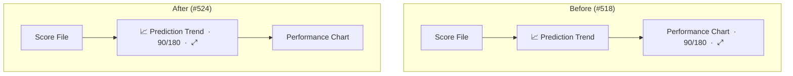

# Move the chart controls onto the Prediction Trend line (issue #524)

## Summary

The 90/180-day window toggle (`#chartWindowControl`) and the mobile expand ⤢
button (`#chartPopoutExpand`) sat on the chart heading row **below** the
**📈 Prediction Trend** button (where issue #518 had placed them). On mobile
this wasted a whole vertical row: Prediction Trend on one line, the toggle and
expand button on the next.

This change lifts that single-row control group **up onto the Prediction Trend
button's line** in the top controls row, so the button, the 90/180 toggle and
the expand ⤢ button now share one horizontal line — exactly as the reporter
circled and arrowed in the issue screenshot. The chart heading row keeps only
the chart title and the single-stock **← Back to Portfolio View** button.

Pure markup/CSS layout move — no behaviour change to the controls themselves;
they keep their existing ids, wiring and `.chart-heading-controls` flex styling,
so the chart-window toggle and pop-out engine continue to work unchanged.

Closes #524.

## Evidence

Mobile (matches the issue screenshot) — the three controls now ride one line:

Desktop — unchanged behaviour; the expand button stays hidden via CSS, the
toggle sits beside the Prediction Trend button:

## Test Plan

- Added `tests/chart_controls_trend_line_test.ts` (#524): asserts the
  `#chartWindowControl` and `#chartPopoutExpand` now follow `#trendViewLink`
  (same line) and precede `#chartTitle`, that they share one
  `.chart-heading-controls` flex wrapper next to the trend button, and that the
  wrapper is laid out as a flex row in `styles.css`. This test fails against the
  pre-fix markup and passes after the move.
- Updated `tests/chart_controls_heading_row_test.ts` (#518): the controls no
  longer sit *after* `#chartTitle` on the heading row, so the title-ordering
  assertions were replaced with the enduring guarantees that survive the move —
  the two controls stay grouped in one flex `.chart-heading-controls` wrapper
  (toggle then expand), remain above the chart card/canvas, and the old stacking
  `mb-2` margin stays removed. This is the documented business-logic change; no
  test was commented out or deleted.
- Full Deno suite (`deno test --allow-read tests/*.ts`) passes — 966 tests.
- `./quality.sh` passes cleanly (Rust fmt/clippy/check/test/coverage + Deno
  fmt/lint/check/test).
