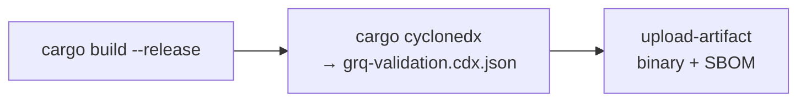

# SCR-SBOM: generate an SBOM for the release binary

## Summary

The CI `build` job compiled and uploaded the release binary
(`grq-validation-release`) but produced no Software Bill of Materials, so
after a dependency compromise is disclosed there was no machine-readable
component inventory to consult during triage.

This change adds a single CycloneDX SBOM-generation step to the `build`
job in `.github/workflows/ci.yml`. It runs `cargo cyclonedx --format json`
to emit `grq-validation.cdx.json` from the Rust lockfile *before* the
artefact upload, and the `actions/upload-artifact` step now uploads both
the binary and the SBOM. This is an informational supply-chain-readiness
improvement — it does not block and is not an active vulnerability.

`Closes #53`

## Evidence

This is a backend/CI change with no web interface to screenshot. Evidence
is the new Deno test suite plus the workflow ordering shown below.



The SBOM step is normalised so the upload always finds
`grq-validation.cdx.json` regardless of how `cargo-cyclonedx` names its
output, failing the step if no CycloneDX file is produced.

Test run (all green):

```
running 4 tests from ./tests/sbom_workflow_test.ts
build job generates a CycloneDX SBOM from the Rust lockfile ... ok
SBOM is generated before the artefact upload ... ok
uploaded artefact includes both the binary and the SBOM ... ok
SBOM workflow file parses as valid YAML with expected name ... ok

ok | 4 passed | 0 failed
```

Full Deno suite: `97 passed | 0 failed`.

## Test Plan

Added `tests/sbom_workflow_test.ts` (TDD — written failing first, then
made to pass), which parses `.github/workflows/ci.yml` and asserts:

- the `build` job runs `cargo cyclonedx` and produces
  `grq-validation.cdx.json`;
- the SBOM step is ordered before the `actions/upload-artifact` step;
- the uploaded artefact path includes both the release binary and the
  SBOM;
- the workflow still parses as valid YAML with the expected name.

## Notes

- `.gitignore` now ignores generated `*.cdx.json` files (produced at build
  time, not committed).
- `CI_CD_SETUP.md` documents the new SBOM step.
- The Rust source is untouched, so the heavy `cargo` portion of
  `quality.sh` (clean + full rebuild + tarpaulin) was not exercised; the
  Deno test/lint/fmt/check steps that cover this change all pass.

### Deno regression avoided

The CI build is Rust-based, so SBOM generation uses `cargo cyclonedx`
rather than introducing any Node tooling into this Deno+Rust repo.
