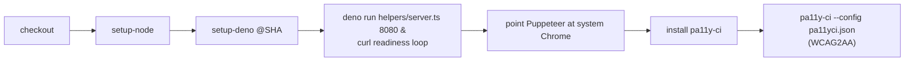

## Summary

The Accessibility (`a11y.yml`) workflow served the `docs/` dashboard for the
pa11y scan by shelling out to an unpinned Node static server fetched at run
time (`npx --yes http-server docs -p 8080`). This is a Deno repo
(`deno.json`, `deno.lock` at the root) that already ships its own reviewed,
tested, loopback-bound static server, `helpers/server.ts`. Pulling
`http-server` (and its transitive tree) from npm on every CI run — with the
checked-out repository in scope — both reintroduced a Node-tooling dependency
the repo had eliminated and opened an unpinned supply-chain surface inside CI.

This PR replaces that step with the in-repo Deno server, run via a
SHA-pinned `denoland/setup-deno` action (mirroring `markdown-lint.yml`).
`helpers/server.ts` reads the port from `Deno.args[0]` (default 8000), so
passing `8080` keeps the existing `curl` health check and the `pa11yci.json`
target URLs unchanged.

Closes #532.

### Deno regression avoided

- Removed `npx --yes http-server` from CI and served `docs/` with the
  in-repo Deno `helpers/server.ts` instead — no Node-only static server
  fetched at run time.

## Evidence

This is a CI-workflow change with no web UI to screenshot. Verified locally
that the in-repo Deno server serves the dashboard on the same port and paths
the workflow and `pa11yci.json` expect:

```
$ deno run --allow-net --allow-read helpers/server.ts 8080 &
UP after 2s
index.html -> HTTP 200
trend.html -> HTTP 200
```

Flow of the updated pa11y job:



## Test Plan

Updated `tests/a11y_workflow_test.ts` (TDD — the three tests below failed
against the old workflow and pass after the change):

- `a11y workflow serves docs/ via the in-repo Deno server` — asserts a step
  runs `deno run ... helpers/server.ts` (structural token match, not a
  source-text grep).
- `a11y workflow does not shell out to npx http-server` — regression guard
  ensuring the unpinned npm server does not return.
- `a11y workflow sets up Deno via a SHA-pinned action` — asserts a
  `denoland/setup-deno@<40-char SHA>` step is present.

All 13 tests in `tests/a11y_workflow_test.ts` pass; `deno fmt --check` and
`deno lint` are clean on the modified file.

Note: one pre-existing Rust unit test (`utils::tests::test_read_market_data`)
fails locally because the current-quarter market-data file is absent in this
environment. It fails identically on the unmodified branch and is unrelated
to this change.
