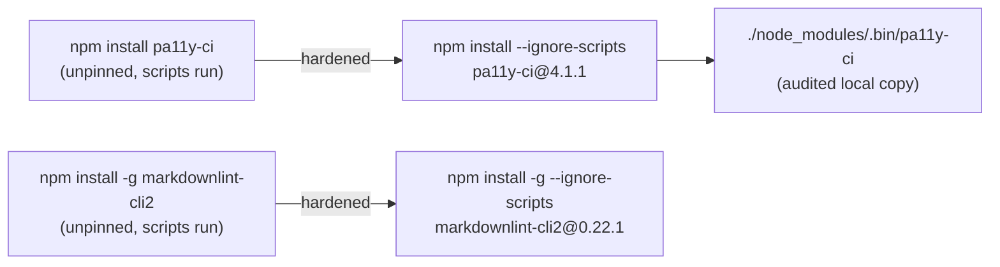

# Harden CI Node-tooling installs with `--ignore-scripts` and version pins

## Summary

Two CI workflows installed Node CLI tooling without `--ignore-scripts` and
without a version pin, so npm lifecycle scripts (`preinstall`/`postinstall`/
`prepare`) of the tool **and its entire transitive tree** executed in CI against
the checked-out workspace, while the resolved version floated to whatever the
registry served on each run — the same install-time code-execution pivot
exploited by the Shai-Hulud and Axios npm incidents.

Both tools are genuinely Node-only (accessibility and markdown linting, no
Deno-native equivalent), so they legitimately stay on Node; only the install
posture is hardened:

- **`.github/workflows/a11y.yml`** — `npm install --no-save pa11y-ci` →
  `npm install --no-save --ignore-scripts pa11y-ci@4.1.1`. The scan now runs the
  locally-installed binary (`./node_modules/.bin/pa11y-ci --config pa11yci.json`)
  instead of a second `npx pa11y-ci` fetch, so the audited, script-disabled copy
  is the one that executes. The workflow already sets `PUPPETEER_SKIP_DOWNLOAD`
  and points Puppeteer at the runner's system Chrome, so puppeteer's
  `postinstall` Chrome download was already a no-op — disabling install scripts
  changes nothing functionally.
- **`.github/workflows/markdown-lint.yml`** — `npm install -g markdownlint-cli2`
  → `npm install -g --ignore-scripts markdownlint-cli2@0.22.1`. `markdownlint-cli2`
  is pure JS with no build step, so `--ignore-scripts` is safe directly.

Versions are pinned to the current latest releases (both well over the 24h
quarantine floor), which CI tests against.

Closes #533.

## Evidence

Backend/CI change with no web interface to screenshot. Verified via the Deno
workflow tests below (all 25 pass) and YAML validation of both workflow files.

## Test Plan

- Updated `tests/a11y_workflow_test.ts::a11y workflow runs pa11y-ci against the
  dashboard pages` to assert the scan runs the locally-installed
  `./node_modules/.bin/pa11y-ci` binary (the invocation changed from `npx`).
- Added `tests/a11y_workflow_test.ts::a11y pa11y-ci install is hardened with
  --ignore-scripts and an exact version pin`.
- Added `tests/a11y_workflow_test.ts::a11y workflow does not run pa11y-ci via npx`
  to guard the regression.
- Added `tests/markdown_lint_workflow_test.ts::Markdown Lint install is hardened
  with --ignore-scripts and an exact version pin`.
- All 25 tests across both workflow test files pass; `deno lint` and `deno check`
  are clean.
