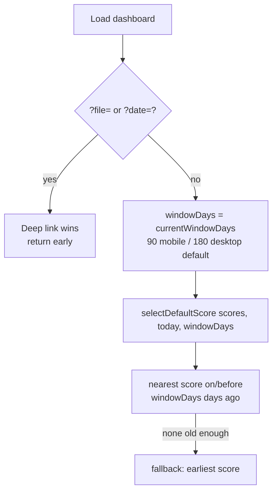

# Default the prediction date to match the selected chart window (90/180)

## Summary

On load, the dashboard's **Prediction Date** defaulted to the nearest score
on/before ~90 days ago even when the active chart window was 180 days (the
desktop default). This change ties the *initial* default prediction-date offset
to the resolved active chart window: a 180-day window defaults to the nearest
score on/before 180 days ago, a 90-day window keeps the ~90-days-ago default.
The general rule applies on both mobile and desktop, to the initial default
selection only — a `?date=`/`?file=` deep link still wins, and toggling the
90/180 control does not re-pick the date. The 90/180 window defaults themselves
(mobile 90, desktop 180) are unchanged.

Frontend only. `Closes #534`.

### Changes

- **`docs/projection.js`** — `selectDefaultScore(scores, today, windowDays = 90)`
  now derives the "on or before N days ago" target from `windowDays` instead of a
  hardcoded 90. The argument defaults to 90 so existing callers/tests are
  unaffected; a non-finite or non-positive value falls back to 90 so a bad input
  can never widen the offset unexpectedly. The "latest score on/before the
  target, else earliest" semantics are retained.
- **`docs/app.js`** — the fallback after the `?file=`/`?date=` deep-link branch
  threads `this.currentWindowDays()` (the resolved effective window from
  `chart_window_settings.js`: `?window=` > saved per-device choice > device
  default) into `selectDefaultScore`.

## Evidence

Playwright MCP was unavailable in this environment, so visual capture was not
possible. The behaviour is verified deterministically against the real
production `docs/scores/index.json` (reference date 2026-06-25):

| Active window | Default prediction date | Score file |
|---------------|-------------------------|------------|
| 90 days       | 2026-03-27 (~90 days back)  | `2026/March/27.tsv` |
| 180 days (desktop default) | 2025-12-27 (~180 days back) | `2025/December/27.tsv` |

Before this change, the desktop 180-day view also defaulted to `2026-03-27`
(the ~90-days-ago date), mismatching its chart window. It now defaults to
`2025-12-27`.

## Test Plan

Extended `tests/score_selection_test.ts` (all pass; 986 Deno tests pass overall):

- `90-day window keeps the ~90-days-ago default`
- `180-day window picks the nearest score on/before 180 days ago`
- `180-day window chooses the LATEST date on/before 180 days ago`
- `180-day window falls back to EARLIEST when none ≥ 180 days old`
- `omitted window argument defaults to the 90-day offset` (back-compat)

The existing #275 regression tests (unchanged) continue to guard the 90-day
behaviour.

> Note: the Rust unit test `utils::tests::test_read_market_data` fails in this
> environment due to a missing market-data fixture file. This failure is
> pre-existing (reproduced on a clean checkout with no changes) and unrelated to
> this frontend-only change.
