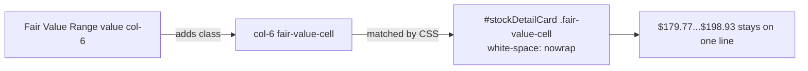

## Summary

The stock detail panel's **Fair Value Range** value was wrapping mid-number on
mobile — `$179.77...$198.93` broke so the final `3` dropped onto a second line —
even though the half-row cell has ample room for the run. Fixed by pinning the
value cell to `white-space: nowrap`, mirroring the existing Buy Price precedent
(issue #383). Closes #538.

- `docs/app.js` — the Fair Value Range value `col-6` now carries a
  `fair-value-cell` class hook.
- `docs/styles.css` — `#stockDetailCard .fair-value-cell { white-space: nowrap; }`
  keeps the range on a single line. Harmless at larger sizes where there is
  plenty of width.

A bounding-box measurement at a 375px phone confirms the run is ~128px wide and
the `col-6` value cell is ~155px wide, so `nowrap` keeps the range on one line
**without** overflowing the cell — there genuinely is plenty of width; the 50/50
split was simply letting the number break.

## Evidence

Detail panel rendered at a mobile viewport with the fix applied — the Fair Value
Range stays on one line:

## Test Plan

- Added `tests/fair_value_range_one_line_detail_test.ts`:
  - asserts the detail-panel Fair Value Range value `col-6` carries the
    `fair-value-cell` hook in `docs/app.js`.
  - asserts `#stockDetailCard .fair-value-cell` is pinned to
    `white-space: nowrap` in `docs/styles.css`.
- Both tests fail against the unfixed code and pass after the change.
- Full Deno suite: `988 passed | 0 failed`. `deno fmt --check`, `deno lint`,
  `deno check` all clean.
- The cargo/Rust portions of `quality.sh` are unaffected — the change touches
  only `docs/` (excluded from cargo) and `tests/*.ts`.
