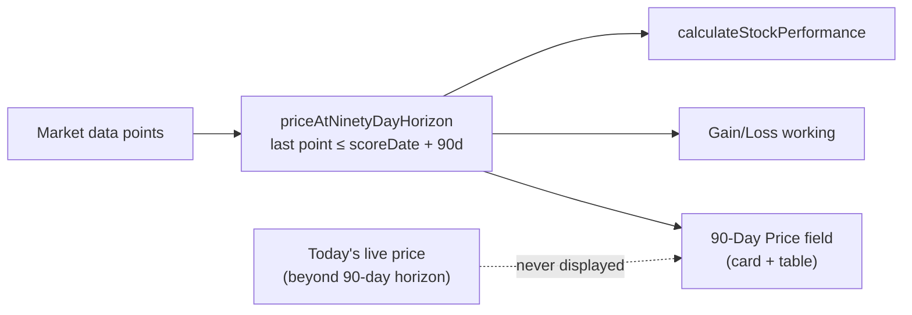

# PR Summary — Issue #539

## Summary

The Individual Stock Performance page labelled **today's live price** as "Current
Price", while Performance and the Gain/Loss working compared the buy price against
the price at the **90-day validation horizon**. The two prices disagreed, so a
90-day prediction that genuinely lost money looked "wrong" — e.g. QCOM bought at
$173, whose 90-day-horizon price was ~$128 (a real loss), but whose live price had
since rallied to ~$203, making the loss look like a gain.

This tool validates how a 90-day AI prediction performed — it is **not** a live
stock-price app. The fix makes the displayed price the **90-day validation price**
(the basis already used by Performance and Gain/Loss) and relabels the field
**"90-Day Price"** everywhere so it can no longer be mistaken for a live quote.

Fixes #539.

### What changed

- **New shared kernel** `GRQProjection.priceAtNinetyDayHorizon(marketData, scoreDate)`
  in `docs/projection.js`: the midpoint of the last market-data point on or before
  90 days after the score date (the latest available point when the 90-day window
  is incomplete). Single source of truth so the displayed price cannot drift from
  the Gain/Loss maths.
- `docs/app.js`:
  - `getCurrentPrice` → `getNinetyDayPrice`, now backed by the new kernel.
  - The `current-price` working now computes and explains the 90-day-horizon price
    ("90-Day Price working: …"), noting whether the window is complete or the
    latest-available price is shown.
  - `calculateStockPerformance` refactored to call the shared kernel (DRY) — same
    result, one implementation.
  - The card's colour-logic price (`currentPriceRaw`) now uses the 90-day basis too.
  - Relabelled "Current Price" → "90-Day Price" in the card field/label/popover,
    the aggregate table header, the table popover, and the Gain/Loss working text.
- `docs/index.html`: static table header "Current Price" → "90-Day Price".
- `README.md`: documents plainly that this is a 90-day prediction-validation tool
  comparing to the price at the 90-day horizon (or latest available if incomplete),
  never today's live price.

The Rust backend already computes `current_price` as the 90-day-end / latest-available
price (`src/utils.rs` ~L1106), so the underlying performance maths was already
correct — the bug was purely the front-end label and the displayed value. No Rust
change was required.

### Data-flow

## Evidence

UI change — dashboard rendered via headless Chrome (Playwright MCP was not
available in this environment; Chrome headless used instead). The aggregate table's
fifth column header now reads **"90-Day Price"**:

## Test Plan

- Added `tests/ninety_day_price_test.ts` exercising the new kernel:
  - Ignores the live price beyond the 90-day window (QCOM-style: returns the
    ~$128 horizon price, not the ~$203 live price).
  - Returns the latest available point when the 90-day window is incomplete.
  - Returns `null` for empty/`undefined`/no-point-on-or-before-horizon inputs.
  - Picks the price exactly on the horizon date.
- `calculateStockPerformance` now shares this kernel, so the existing performance
  tests continue to assert the same numbers via one implementation.
- Full suites green: `deno test --allow-read tests/*.ts` (992 passed), `cargo test`,
  `cargo clippy -D warnings`, `deno lint`, `deno check`.
