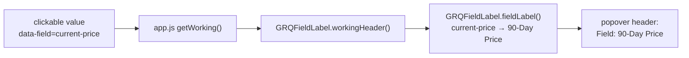

# Correct the misleading "current price" label in the "show working" popover

## Summary

The "show the working" popovers rendered their header from the RAW internal
field id, so the price working read **`Field: current-price`**. That label is
wrong/misleading: the dashboard deliberately labels this figure **"90-Day
Price"** (issue #539) and never shows today's live price beyond the 90-day
horizon, so "current price" can be mistaken for a live quote.

The fix maps each internal `data-field` id to the same human-readable display
label the column headers and popover titles already use, and the working header
now renders that label instead of the raw id — e.g. `Field: 90-Day Price`. The
mapping lives in a new pure helper (`docs/field_label.js`, published on
`globalThis.GRQFieldLabel`) so the browser dashboard (via `app.js`) and the Deno
tests exercise the exact same code, mirroring `docs/color_key.js` /
`docs/series_label_colour.js`. Display/labelling only — no figures or formulae
change.

Closes #542.

## Evidence

Playwright MCP was not available in this run, so the popover could not be
screenshotted. The change is exercised through the real shipped helper instead.
Before/after of the working-popover header (produced by calling the shipped
`GRQFieldLabel.workingHeader`):

```text
BEFORE: Stock: NYSE:SCHW | Field: current-price | Score Date: 2025-01-15
AFTER:  Stock: NYSE:SCHW | Field: 90-Day Price | Score Date: 2025-01-15
```

Data flow of the working header:



## Test Plan

- Added `tests/show_working_field_label_test.ts` (7 tests) covering:
  - `fieldLabel("current-price")` returns `"90-Day Price"` (the bug fix).
  - No label in the map uses the misleading "Current Price" wording.
  - Every documented field id maps to its established display label.
  - Unknown ids fall back to the raw id; empty/missing input returns `""`.
  - `workingHeader(...)` renders the friendly label and never leaks the raw
    `current-price` id, keeping the stock symbol and score date verbatim.
- `app.js` now builds the working header via `GRQFieldLabel.workingHeader`, with
  a literal-string fallback when the helper is absent.
- Full Deno suite passes (`deno test --allow-read tests/*.ts` → 999 passed, 0
  failed); `deno fmt`, `deno lint` and `deno check` are clean.
- The Rust backend is untouched by this UI-only change.
