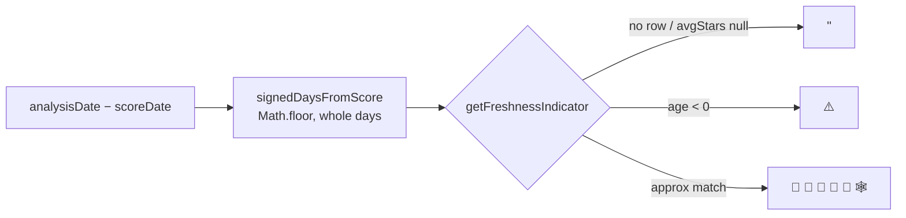

# Freshness foundation: signed analysis age + emoji-mapping helper

## Summary

Adds the shared foundation for the fair-value freshness indicator
(sub-issue of #545). Closes #547.

Two changes in `docs/app.js`:

1. **Signed, whole-day analysis age.** `loadAnalysisData()` now stores
   `signedDaysFromScore = Math.floor((analysisDate − scoreDate) / oneDay)` on
   each analysis row alongside the existing absolute `daysFromScore`. The value
   is **negative** when the analysis is dated *after* the score date — an
   invariant the pipeline must never violate. It is deliberately **not**
   collapsed with `Math.abs`, so the violation is no longer masked. The existing
   absolute `daysFromScore` and the 30-day load-window filter are left
   unchanged (out of scope).

2. **`getFreshnessIndicator(stockSymbol)` helper.** Maps the signed whole-day
   age onto the Google-Sheet emoji scale using a VLOOKUP-style approximate match
   (largest threshold ≤ age):

   | age (whole days) | emoji |
   |---|---|
   | 0–1 | 🌹 |
   | 2–3 | 🌺 |
   | 4–6 | 🥀 |
   | 7–9 | 🍁 |
   | 10–13 | 🍂 |
   | 14+ | 🕸 |

   Returns `''` when there is no analysis row or `avgStars === null` (stars show
   N/A → no emoji), and `'⚠️'` when the signed age is negative.

Wiring the emoji into the table column, mobile card, and click-popover is
handled by the dependent display sub-issues — this change adds the data field,
helper, and tests only.

## Evidence

Backend/logic change with no standalone UI to screenshot (display wiring is in
dependent sub-issues). Verified via unit tests — full Deno suite green
(`1004 passed | 0 failed`).

## Test Plan

Added `tests/freshness_indicator_test.ts` mirroring `tests/star_rating_test.ts`:

- **Bucket boundaries** — ages 0, 1, 2, 3, 4, 6, 7, 9, 10, 13, 14 each map to
  the expected emoji.
- **Large age** — 21 and 30 days stay in the 🕸 bucket.
- **Negative age** — −1 and −5 return `⚠️`.
- **No analysis data** — missing stock returns `''`.
- **avgStars null** — returns `''`, including when age is also negative.

All tests pass; `deno lint`, `deno check`, and the full `deno test` suite remain
green.
