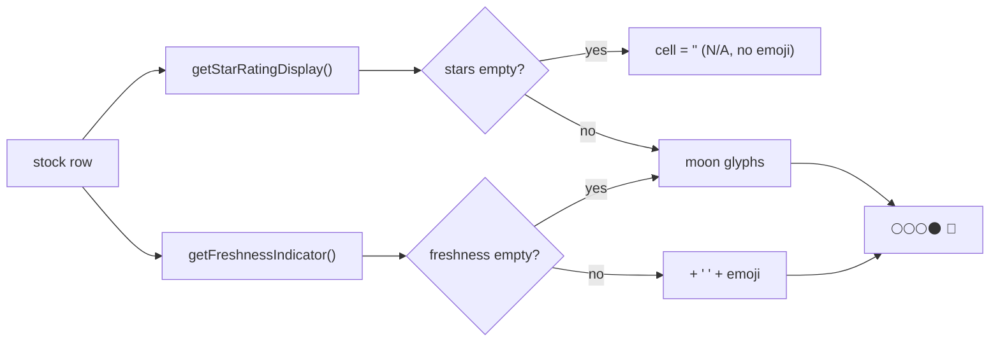

## Summary

Show the fair-value freshness emoji (issue #547's `getFreshnessIndicator()`)
**beside** the existing star rating in the desktop/aggregate score **table**.
The "Stars" `<td>` now appends the freshness indicator after the moon glyphs so
the cell reads e.g. `🌕🌕🌕🌑 🌺`. The emoji accompanies the stars — it does not
replace them. Closes #548.

Behaviour:
- **Fresh row** → moon glyphs then the freshness emoji, separated by one space
  (e.g. `🌕🌕🌕🌕 🌹` for same-day analysis).
- **N/A stars** → empty cell. Both `getStarRatingDisplay()` and
  `getFreshnessIndicator()` return `''` for no-analysis / `avgStars === null`,
  and the append is guarded so there is no stray space and no lone emoji.
- **Negative-age row** → `⚠️` beside the stars (the helper surfaces the
  pipeline invariant breach).

### Change

`docs/app.js` — aggregate-table "Stars" cell:

```js
${this.getStarRatingDisplay(stock.stock)}${this.getFreshnessIndicator(stock.stock) ? ` ${this.getFreshnessIndicator(stock.stock)}` : ""}
```

The freshness emoji is only appended (with its leading space) when the helper
returns a non-empty value, keeping the N/A cell clean.



## Evidence

Playwright MCP was unavailable in this run, so visual capture was not possible.
The combined cell output was verified directly across every scenario by running
the exact app.js combine logic:

| avgStars | signed age | rendered cell |
|----------|-----------|---------------|
| 3.1 | 3 days | `🌕🌕🌕🌑 🌺` |
| 4.0 | 0 days | `🌕🌕🌕🌕 🌹` |
| 3.0 | 12 days | `🌕🌕🌕 🍂` |
| null | 5 days | `` (empty — N/A) |
| 4.0 | -1 day | `🌕🌕🌕🌕 ⚠️` |

## Test Plan

Extended `tests/star_rating_test.ts` with four tests:
- `Table Stars cell - freshness emoji renders beside the rating` — fresh rows
  show the moon glyphs then the freshness emoji.
- `Table Stars cell - N/A stars produce no emoji and no stray space` — null
  stars give an empty cell, even with a negative age.
- `Table Stars cell - negative age shows ⚠️ beside the rating`.
- `app.js: table Stars cell wires freshness beside the star rating` — guards the
  source wiring (fails against the pre-change `app.js`, confirming TDD).

Full suite green via `./quality.sh`.
