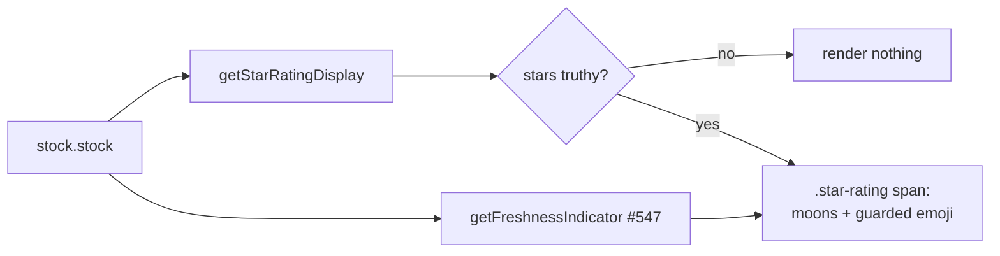

## Summary

Show the fair-value freshness emoji (issue #547) **inline beside** the existing
star rating on the **mobile detail card**, mirroring the aggregate-table cell
delivered in #548. The emoji is appended **inside** the compact `.star-rating`
span, right after the moon glyphs, and guarded so an empty indicator adds no
stray space:

```js
${this.getStarRatingDisplay(stock.stock) ? ` <span class="clickable-value star-rating" ...>${this.getStarRatingDisplay(stock.stock)}${this.getFreshnessIndicator(stock.stock) ? ` ${this.getFreshnessIndicator(stock.stock)}` : ""}</span>` : ''}
```

Because the whole star block already sits behind the
`getStarRatingDisplay(stock.stock) ? … : ''` guard, the N/A case (no analysis
data) renders nothing — no moons and no emoji. A negative-age row surfaces `⚠️`.

No CSS change was needed: the existing
`#stockDetailCard .buy-price-cell .star-rating` rule (smaller font +
tightened letter-spacing, issue #383) already renders the emoji compactly
inline with the moons, on the same line as the Buy Price, without wrapping.

Closes #549.

Sub-issue of #545; depends on #547's `getFreshnessIndicator()` helper.

## Evidence

The detail card renders the freshness emoji inline beside the moon glyphs, on
the Buy Price line. Captured at a 390×844 mobile viewport via Playwright against
the live dashboard (`index.html?date=2026-06-22&stock=NYSE:AIV`).

**Negative-age row (`⚠️`)** — every analysis row for the 2026-06-22 score is
dated before the score date, so the established #547 sign convention yields a
negative age and the helper returns `⚠️`. This is the real, unmodified render
and satisfies the negative-age acceptance criterion:


**Fresh row (flower emoji)** — to visually confirm the primary case renders
compactly in the same span, the helper was overridden at runtime to return a
fresh `🌺` for this stock and the card re-rendered. The flower sits compactly
beside the moons on one line:




## Test Plan

- Added to `tests/buy_price_one_line_detail_test.ts`:
  - `app.js: detail-panel star-rating span appends a guarded freshness indicator`
    — asserts the detail card appends a guarded `getFreshnessIndicator(stock.stock)`
    after the stars, inside the `.star-rating` span.
  - `app.js: detail-panel freshness emoji stays inside the star block guard`
    — asserts the emoji lives inside the `getStarRatingDisplay ? … : ''`
    truthiness guard, so N/A renders nothing.
- Behaviour of the helper's fresh / N/A / negative-age outputs is already
  covered by `tests/freshness_indicator_test.ts` and `tests/star_rating_test.ts`
  (issues #547/#548).
- Full gate green: `./quality.sh` (Rust fmt/clippy/test + `deno fmt`/`lint`/
  `check`/`test`) — 986 Deno tests pass.
