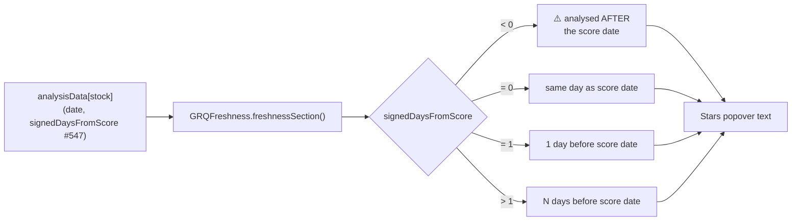

# Stars click-popover: show exact analysis age + date (#550)

## Summary

The Stars "show the working" click-popover now appends a **freshness section**
giving the **exact analysis date** and the **whole-day age of that analysis
relative to the viewed score date** — the precise number behind the inline
freshness emoji (issue #547). For example:

```
Analysis freshness:
= Analysed: 20 Jun 2026
= 5 days before score date
```

The age is **always measured against the viewed score date, never against
today** — the dashboard judges how good the prediction was on the chosen date.

Edge cases handled:

- **Singular vs plural** — `1 day before score date` vs `N days before score date`.
- **Same day** — age `0` → `same day as score date`.
- **Negative age** (analysis dated *after* the score date, a data-pipeline
  invariant violation) → the age line is replaced with
  `⚠️ analysed AFTER the score date (data-pipeline error — should never happen)`,
  mirroring the inline `⚠️` from #547.
- **No analysis data** — the existing
  `No analysis data available for this stock` branch is unchanged (the
  freshness section is only appended when an analysis row exists).

Closes #550.

## Design

The age/date formatting lives in a new **pure classic script**
`docs/freshness_text.js`, published on `globalThis.GRQFreshness`, mirroring
`docs/field_label.js` (#542). This lets the browser dashboard (`docs/app.js`)
and the Deno tests exercise **exactly the same code**. The date is formatted
manually (`20 Jun 2026`) rather than via `toLocaleDateString`, because Deno's
ICU build renders the `"short"` month as the full name (`June`) — the manual
short-month table is deterministic in both the browser and the tests.

`docs/app.js` `case "stars":` reads `this.analysisData[stockSymbol]` (its
`date` and signed `signedDaysFromScore` fields from #547) and appends
`GRQFreshness.freshnessSection(...)` to the working text.

The new script is loaded before `app.js` in both `docs/index.html` and
`docs/trend.html`, added to the service-worker precache list in `docs/sw.js`,
and the app version is bumped `1.1.7 → 1.1.8` so existing clients re-precache.



## Evidence

Playwright MCP was unavailable in this run, so UI evidence is the **actual
rendered popover text** produced by the real shared module
(`docs/freshness_text.js`) driven from the same inputs the dashboard supplies:

```
Stock: NYSE:SCHW | Field: Stars | Score Date: 2026-06-25

Stars working:
= MorningStar: 4 stars
= Tips Stars: 6 stars (normalized to 3.0 stars)
= Average: (4 stars + 3.0 stars) / 2 = 3.50 stars

Rounding to nearest quarter:
= 3.50 × 20 = 70.0
= Rounded to 70 twentieths
= Full stars: 70 ÷ 20 = 3
= Remainder: 70 - (3 × 20) = 10 twentieths
= Partial stars: 10 ÷ 5 = 2.0 → 2 quarters
= Moon phase: 🌓 (half moon)
= Display: 🌟🌟🌟🌓

Analysis freshness:
= Analysed: 20 Jun 2026
= 5 days before score date
```

Edge-case sections (same inputs, different ages):

```
= Analysed: 25 Jun 2026
= same day as score date
---
= Analysed: 24 Jun 2026
= 1 day before score date
---
= Analysed: 27 Jun 2026
= ⚠️ analysed AFTER the score date (data-pipeline error — should never happen)
```

## Test Plan

- **New** `tests/stars_popover_freshness_test.ts` — exercises the shared
  `GRQFreshness` helpers:
  - `formatAnalysisDate` — `20 Jun 2026` / `1 Jan 2025` / `31 Dec 2024`, and
    `''` for invalid/missing dates.
  - `analysisAgeLine` — plural, singular, zero (same-day) and negative
    (⚠️ pipeline error) cases, asserting the negative case never reads as an
    ordinary age line.
  - `freshnessSection` — date + age appear together for plural, same-day and
    negative inputs.
- Full suite green: `deno test` → **995 passed, 0 failed**.
- `./quality.sh` passes cleanly (lint, type-check, Rust, Deno tests).
