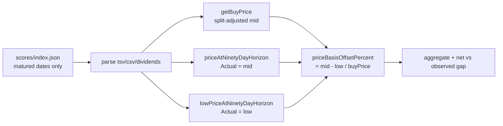

## Summary

Quantifies the Target/Actual measurement bias that comes purely from the **price
basis** mismatch between training and the dashboard (one candidate source in the
#544 milestone breakdown). The GRQ model is trained on the **intraday low** of
the trading day 90 days ahead, while the dashboard measures **Actual** at the
**midpoint** `(high + low) / 2`. Because `mid >= low` on every row this is a
structural, same-direction offset.

The deliverable is a **written diagnostic** plus a reproducible analysis, both
computed with the dashboard's own shipped kernels. Over the matured historical
score set (274 score dates, 5 444 included stock-rows, as-of 2026-06-26):

- Mean per-row basis offset `(mid - low) / buyPrice` = **+2.235 pp** (median
  +1.546 pp, std dev 3.216 pp); **non-negative on every row** (sign **+**).
- The mid basis **narrows / masks** the gap rather than causing it: the observed
  Target-over-Actual gap is **+18.470 pp** on the mid basis and **+20.712 pp** on
  the trained low basis — restating Actual onto the trained basis **widens** the
  gap by **+2.242 pp**.
- **Recommendation:** the asymmetry is real but this candidate is **exonerated as
  a cause** — correcting it widens, not closes, the gap. Leave the dashboard's
  user-facing Actual on the (unbiased) midpoint; if a fully like-for-like
  comparison is later wanted, restate the *Target* onto the midpoint basis
  upstream in `GRQ`. Genuine model optimism and the other #544 candidates remain
  the drivers to chase.

Full write-up: `docs/archive/investigations/issue-552-price-basis-bias.md`.

Closes #552.

### Deno regression avoided

This is a Deno repo; the diagnostic ships as Deno-native TypeScript run via
`deno task diagnose-price-basis` (and `deno test`), with no Node tooling
introduced.

## Evidence

Backend/CLI diagnostic — no web UI to screenshot. Verified by the new test
suite and by running the diagnostic against the committed score data:

```text
$ deno task diagnose-price-basis docs 2026-06-26
Matured score dates:   274
Included stock-rows:   5444
## Per-row basis offset (mid - low) / buyPrice
Mean:                  +2.235 pp
Median:                +1.546 pp
Min:                   +0.000 pp
Max:                   +93.273 pp
Std dev:               3.216 pp
Observed gap (T-A,mid):+18.470 pp
Gap on low basis:      +20.712 pp
Basis contribution:    +2.242 pp
```



## Test Plan

New tests in `tests/price_basis_diagnostic_test.ts` (all exercise real shipped
kernels / aggregation with synthetic data — no source-text grepping):

- `lowPriceAtNinetyDayHorizon` returns the in-window low, picks the **same row**
  as `priceAtNinetyDayHorizon`, and guards empty/null data.
- `priceBasisOffsetPercent` computes `(mid - low) / buyPrice * 100`, is always
  `>= 0` when `mid >= low`, and guards bad inputs.
- `summariseOffsets` mean/median/min/max/stdDev plus the empty case.
- `aggregateDate` measures the per-row offset over included stocks and confirms
  the mid-vs-low Actual difference equals the offset.
- `buildReport` confirms the basis contribution **widens** the gap and the
  verdict states the masking sign.

Existing suite unchanged: `deno test --allow-read tests/*.ts` → 1010 passed.
