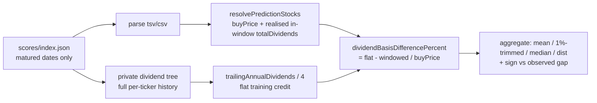

## Summary

Adds a written diagnostic and reproducible analysis quantifying the
Target-over-Actual bias that comes purely from the **dividend basis** mismatch
between training and the dashboard (milestone #544 candidate). The upstream training bakes
a **flat** quarter of the trailing annual dividend, `core.yearOfDividends / 4`,
into the total-return label for **every** stock
(the upstream training code), whereas the validation side credits only the
**actual ex-dividends inside the 90-day window**
(`GRQ-validation/src/utils.rs` `calculate_dividends_for_period`, mirrored by the
shipped JS kernels `filterDividendsWithin90Days` + `sumDividends`).

Over the matured score set (274 score dates, 5 444 included stock-rows, as-of
2026-06-26) the per-row difference `(flatCredit − windowedCredit) / buyPrice` is
**+2.827 pp raw / +1.358 pp (1%-trimmed)**, median 0, **sign +**. The flat
training quarter is a **consistent over-credit** relative to realised in-window
dividends, so — because Target embeds the flat credit while Actual credits only
realised dividends — this dividend basis **contributes to (widens)** the
Target-over-Actual gap (the *opposite* of the price-basis candidate #552, which
masked it). The raw mean is lumpy: 86.4 % of rows fall within ±1 pp and a few
special/liquidating distributions on low-priced stocks (EQC, ELME, VISN)
dominate the tails, so the robust contribution is ~+1.4 pp. The main
same-direction driver is that **45.2 % of included rows realise zero in-window
dividends yet still receive the flat quarter in training**.

**Recommendation:** a genuine, modest, same-direction contributor worth fixing
by **aligning both sides on realised in-window dividends** — the clean fix is
upstream (train/evaluate the label on the forward-window dividends
rather than a flat `yearOfDividends / 4`), since degrading the dashboard's
realised "Actual" to a fabricated flat quarter would credit dividends never
received. The root-cause training-label change is out of scope for this
`GRQ-validation` diagnostic and is carried as a fix candidate under #544.

Closes #553.

## Evidence

Backend/CLI diagnostic — no web UI to screenshot. Verified by the new unit tests
(below) and by running the reproducible report:

```text
$ deno run --allow-read scripts/diagnose_dividend_basis.ts docs 2026-06-26 ../private-dividend-tree
Matured score dates:     274
Included stock-rows:     5444
Mean (raw):              +2.827 pp
Mean (1%-trimmed):       +1.358 pp
Median:                  +0.000 pp
Within +/-1 pp:          86.4 %
Mean flat credit yield:  3.656 %
Mean windowed yield:     0.829 %
Rows with 0 in-window:   45.2 %
Gap contribution:        +2.827 pp
```

The full written diagnostic (mechanism, tables, mermaid flow, recommendation,
acceptance criteria) lives in
`docs/archive/investigations/issue-553-dividend-basis-bias.md`.



## Test Plan

- `tests/dividend_basis_diagnostic_test.ts` (new, 14 tests) exercises the real
  shipped kernels and the real aggregation with synthetic data:
  - `trailingAnnualDividends` trailing-year sum, boundary semantics
    (`> scoreDate-365 && <= scoreDate`), and empty/invalid guards.
  - `dividendBasisDifferencePercent` arithmetic, the offsetting (negative)
    direction, and bad-input guards.
  - `stripSymbol` exchange-prefix/dot normalisation matching
    `extract_symbol_from_ticker`.
  - `summariseDiffs` and `trimmedMean` statistics, including outlier robustness.
  - `aggregateDate` for a semi-annual payer (flat > windowed, zero in-window)
    and a quarterly payer (flat ≈ windowed, nets to ~0).
  - `buildReport` contributing (+) and offsetting (−) verdicts and the
    `within1ppSharePct` / `windowedZeroSharePct` aggregates.
- All run read-only under `deno test --allow-read`; pure functions assert on
  computed results, not source text.

## Files

- `docs/projection.js` — new shipped kernels `trailingAnnualDividends` and
  `dividendBasisDifferencePercent` (published on `GRQProjection`).
- `scripts/dividend_basis_diagnostic.ts` — pure aggregation + disk loader.
- `scripts/diagnose_dividend_basis.ts` — CLI report (`deno task
  diagnose-dividend-basis`).
- `tests/dividend_basis_diagnostic_test.ts` — kernel + aggregation tests.
- `docs/archive/investigations/issue-553-dividend-basis-bias.md` — written
  diagnostic.
- `deno.json`, `README.md` — task entry and script-tree documentation.
