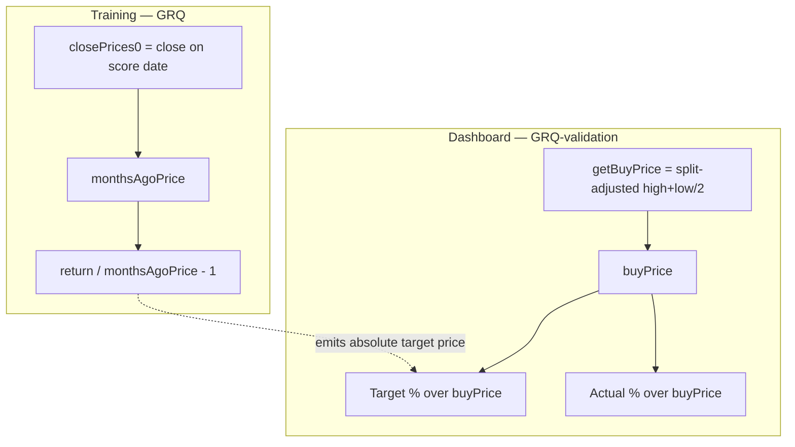

## Summary

Diagnostic for issue #554 (sub-issue of milestone #544): quantify the
Target/Actual bias that comes purely from the **buy-price denominator**
mismatch — training divides the 90-day return by `monthsAgoPrice` (the **close**
on the score date), while the dashboard divides **both** Target and Actual by
`buyPrice` (the split-adjusted **midpoint** of the first usable point).

The headline finding: because the dashboard applies the **same** `buyPrice` to
Target and Actual, the denominator choice **cannot desynchronise** them — it
only rescales the existing gap by `buyPrice / close`. Over the matured
historical score set the denominator offset is **near-zero and symmetric**
(mean **+0.046 pp**, median 0.000 pp), contributing a negligible **+0.048 pp**
to the ~18.5 pp gap. This candidate is **exonerated** as a cause of the gap;
recommendation is to **leave** the dashboard denominator as-is.

Closes #554.

### Acceptance criteria

- **Numeric denominator offset (pp) with sign** — mean **+0.046 pp** per row /
  **+0.048 pp** portfolio-level; roughly symmetric (median 0.000 pp, min
  −11.868 pp, max +9.886 pp, σ 1.418 pp) over 274 matured dates, 5 444 rows
  (as-of 2026-06-26).
- **Yes/no — are Target vs Actual desynchronised by the denominator choice?**
  **NO.** `calculatePortfolioTargetPercentage` and
  `calculateIncludedPortfolioPerformance` both divide by the **same** per-stock
  `buyPrice`; the only mixed-basis level is the model's emitted absolute target
  price (trained against the close), but since Actual uses the same `buyPrice`
  the choice rescales both identically.
- **Fix-vs-leave recommendation** — **leave**: the offset is negligible and the
  denominator is already shared; the midpoint buy price is also the more
  defensible, split-aware cost basis. The dominant masking term is the price
  basis (#552), not the denominator.

## Evidence

Backend/CLI diagnostic — no web UI change, so no screenshot. Reproduce with:

```bash
deno task diagnose-buy-price-denominator            # against docs/, as-of today
deno run --allow-read scripts/diagnose_buy_price_denominator.ts docs 2026-06-26
```

Output (as-of 2026-06-26):

```
## Per-row denominator offset (buyPrice - close) / buyPrice
Mean:                  +0.046 pp
Median:                +0.000 pp
Min:                   -11.868 pp
Max:                   +9.886 pp
Std dev:               1.418 pp

Observed gap (mid):    +18.470 pp
Gap on close basis:    +18.517 pp
Basis contribution:    +0.048 pp
```

Full write-up: `docs/archive/investigations/issue-554-buy-price-denominator-bias.md`.



## Test Plan

Added `tests/buy_price_denominator_diagnostic_test.ts` (11 tests), exercising
the real shipped kernels and aggregation with synthetic data:

- `buyPriceCloseBasis` — returns the split-adjusted close of the first usable
  point; picks the **same** row as `getBuyPrice`; null on no data.
- `denominatorBasisOffsetPercent` — `(buyPrice − close) / buyPrice * 100`,
  including the negative-offset (close above midpoint) case and input guards.
- `summariseOffsets` — mean/median/min/max/stdDev and empty input.
- `aggregateDate` — per-row offset; and that a smaller denominator inflates
  **both** Target and Actual together (the no-desync property).
- `buildReport` — gap rescale, basis contribution, and verdict wording
  (states "does NOT desynchronise"; renders a negative mean sign).

All 1035 Deno tests pass; `deno fmt`, `deno lint` and `deno check` clean.

## Files

- `docs/projection.js` — new shipped kernels `buyPriceCloseBasis`,
  `denominatorBasisOffsetPercent` (exported on `GRQProjection`).
- `scripts/buy_price_denominator_diagnostic.ts` — pure aggregation + disk loader.
- `scripts/diagnose_buy_price_denominator.ts` — CLI report runner.
- `tests/buy_price_denominator_diagnostic_test.ts` — tests.
- `deno.json` — `diagnose-buy-price-denominator` task.
- `README.md` — scripts listing.
- `docs/archive/investigations/issue-554-buy-price-denominator-bias.md` — write-up.
