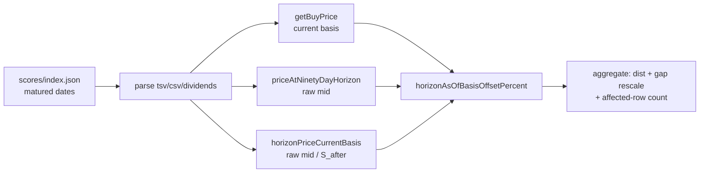

## Summary

Audited **market-data timing & corporate-action parity** between GRQ training
and the GRQ-validation dashboard, as requested by the milestone #544 breakdown.
The audit enumerates each timing/adjustment decision on both sides, marks it
**aligned** or **divergent**, and — for the one divergent row — quantifies its
aggregate contribution to the Target-over-Actual gap using the dashboard's own
shipped kernels. Closes #555.

**Finding.** Three of four decisions are aligned; one is divergent:

| # | Decision | Status |
| --- | --- | --- |
| 1 | Horizon-date selection (trading day on/before `+90d` vs last point `<= +90d`) | **Aligned** — same row on the stock's daily series |
| 2 | OHLC field at the horizon (low vs midpoint) | **Divergent** — owned by #552 (~+2.2 pp) |
| 3 | OHLC field at the buy point (close vs midpoint) | **Divergent** — owned by #554 (~+0.05 pp) |
| 4 | Split/merge adjustment convention (restate-to-current, reconciliation-gated) | **Aligned** |
| 5 | **As-of split basis of the Actual horizon price** | **DIVERGENT (this audit)** |

Row 5: the dashboard restates the **buy price** and the **model target** into
current (end-of-series) split terms but reads the **Actual horizon price RAW**.
When a reconcilable split falls between the 90-day horizon and the data-series
end, the Actual carries a spurious post-horizon split factor `S_after` that
training (and the economically-correct return) cancels. Target % is unaffected
(both `adjustedTarget` and `buyPrice` divide by the same factor).

**Measured (as-of 2026-06-26, 274 matured dates, 5 444 included rows):** 123
rows carry a reconcilable post-horizon split; restating their Actual onto the
buy price's basis moves the portfolio gap by **+0.482 pp** (a *masking* term —
forward splits dominate), with large two-sided per-row distortion (−316 →
+1 396 pp). Like #552/#554 the candidate *offsets* rather than causes the gap,
but it also flags a genuine per-row correctness bug. **Recommendation:** read
the horizon price through the new `horizonPriceCurrentBasis` so Actual shares
the buy price's basis — landed as its own focused PR with UI evidence (this PR
is the audit + measurement only, matching the sibling diagnostics).

## Evidence

CLI/analysis change — no UI was modified, so no screenshot. Verified by the new
unit tests and the reproducible diagnostic run below (delegating to the shipped
`GRQProjection` kernels, so it measures the dashboard's own basis):

```
$ deno run --allow-read scripts/diagnose_horizon_split_parity.ts docs 2026-06-26
Matured score dates:      274
Included stock-rows:      5444
Post-horizon split rows:  123
Mean Target %:            28.916 %
Mean Actual % (raw):      10.447 %   # reproduces the #554 dashboard Actual exactly
Mean Actual % (current):  9.965 %
Observed gap (T-A,raw):   +18.470 pp
Gap on current basis:     +18.952 pp
Basis contribution:       +0.482 pp
```



Full written parity audit (table, mechanics, fix/ruled-out notes):
`docs/archive/investigations/issue-555-market-data-timing-corporate-action-parity.md`.

## Test Plan

- `tests/horizon_split_parity_diagnostic_test.ts` (18 cases) — exercises the new
  shipped kernels and the real aggregation with synthetic market data:
  - `horizonPointDate` row selection (happy / empty / all-after-horizon).
  - `postHorizonSplitFactor` — no split (1.0), reconcilable forward split (2.0),
    reverse split (0.5), and a split **on/before** the horizon ignored.
  - `horizonPriceCurrentBasis` — raw mid ÷ factor; coincides with the raw mid
    when no split follows; null on no usable point.
  - `horizonAsOfBasisOffsetPercent` — formula, forward (+) / reverse (−) sign,
    and input guards (zero/negative buy price, NaN).
  - `aggregateDate` — a post-horizon split desynchronises Actual but not Target;
    the two Actual bases coincide with no split.
  - `buildReport` — forward-split contribution widens the consistent-basis gap;
    zero affected rows ⇒ DORMANT verdict / 0 pp; `summariseOffsets` stats.
- Full suite green: `deno test --allow-read tests/*.ts` → **1053 passed**.
- New `deno task diagnose-horizon-split-parity` registered in `deno.json`.
