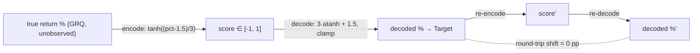

## Summary

Adds a diagnostic that confirms the score→target decode
(`reverseProfitRecommend`) introduces **no systematic bias** into the
dashboard's Target, as asked by Issue #556 (sub-issue of milestone #544).
Closes #556.

The AI emits a score in `[-1, 1]`; the GRQ dashboard derives Target via
`reverseProfitRecommend(price, score)` (upstream in `GRQ`). The forward training
encode is `profitRecommend(pct) = tanh((pct - 1.5) / 3)` and the reverse is
`pct = 3·atanh(score) + 1.5` with clamps (`score >= 1` → +50%, `score <= -1` →
target 0, interior pct capped to ±50%). The issue asked whether the **asymmetric
clamps** (`0` floor vs +50% cap) bias Target over the realised score
distribution.

**Finding — ruled out.** Over the realised scores the round-trip
`profitRecommend ∘ reverseProfitRecommend` shifts Target by **0 pp** (machine
epsilon: max |shift| `1.78e-15` pp across all 7 108 stock-rows). `tanh`/`atanh`
are exact inverses, and the asymmetry is **dormant**: the +50% cap fires (45.97 %
of matured rows) but round-trips cleanly, while the `0`/-100% floor **never
fires** (zero negative scores exist in the entire history). The decode is faithful
— no dashboard fix is warranted.

The one residual candidate is **encode-side quantisation** (a saturated
`score == 1` is a fixed +50% point estimate of an unknown true intent ≥ the
saturation threshold). That information is lost inside `GRQ` at encode time and
is **not** a `reverseProfitRecommend` round-trip asymmetry, so it is flagged for
a `GRQ` follow-up rather than fixed here. **Cross-repo:** this is a `GRQ` root
cause; the diagnostic is filed here per the issue and the residual encode-side
candidate is recommended for a `GRQ` issue.

## Evidence

Backend/CLI diagnostic — no web interface to screenshot. The diagnostic runs on
the committed score history (read-only):

```text
$ deno task diagnose-score-target-decoding   # matured, as-of 2026-06-26
Score dates:           274
Score rows:            5508

## Round-trip Target shift (profitRecommend ∘ reverseProfitRecommend)
Mean:                  +0.000000 pp
Max:                   +0.000000 pp   (true max |shift| 1.78e-15 pp)

## Clamp-region census (realised scores)
interior               2976  54.03 %
cap_high               2532  45.97 %
floor_low                 0   0.00 %   ← asymmetric floor never fires
interior_cap_high         0   0.00 %
interior_cap_low          0   0.00 %

VERDICT (decode round-trip RULED OUT): … decoding adds NO systematic Target shift …
```



Full write-up:
`docs/archive/investigations/issue-556-score-target-decoding-bias.md`.

## Test Plan

Added `tests/score_target_decoding_diagnostic_test.ts` (12 tests, all calling the
real ported functions and aggregation):

- `profitRecommend` matches `tanh((pct-1.5)/3)`; `reverseProfitPct` is the clean
  interior inverse; the +50% cap (`cap_high`), `0`/-100% floor (`floor_low`) and
  interior caps are each asserted.
- `reverseProfitTarget` reproduces stored Targets anchored to real rows
  (`score == 1` → `1.5 × price`; interior row → stored Target) and the 0 floor.
- `roundTripShiftPp` is ~0 for interior scores and at the saturated `+1` clamp.
- `buildReport` rules out decode bias on a realistic positive-only mixture,
  census fractions sum to 1, and empty input yields a zeroed report.
- `computeDecodingDiagnostic` reads scores from a synthetic docs tree and honours
  matured-only vs all-dates selection.

Quality gate: `./quality.sh` (cargo fmt/clippy/test + `deno fmt`/`lint`/`check`/
`test`) run clean.
