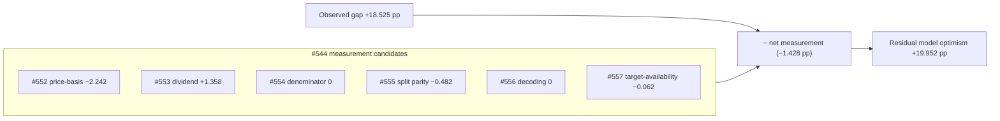

## Summary

Completes the milestone #544 breakdown with the **catch-all whole-application
sweep** for any remaining same-direction Target/Actual asymmetry, plus a
**residual-gap reconciliation** that nets the observed Target-over-Actual gap
against every quantified #544 candidate (#552–#556) and this sweep's own finding.
Closes #557.

The sweep audits the aggregation layer the targeted sub-issues did not cover —
aggregation weighting, the inclusion gate, rounding/null handling, FX, and
divergent code paths — and confirms Target and Actual are aggregated by the
**same equal-weight rule** over the **same `isStockIncluded` gate** through the
**same shared `projection.js` kernels**. It surfaces exactly one residual
aggregation-layer asymmetry — the **target-availability denominator skew**
(priceable stocks with a missing target are counted in Actual but dropped from
Target) — and shows it is **immaterial and masking, not inflating** (−0.062 pp
over 131 of 5 444 included rows).

Reconciliation over the committed matured set (274 dates, 5 444 rows,
as-of 2026-06-26):

| Contribution (+ inflates gap, − masks) | pp |
| --- | --- |
| #552 price-basis | −2.242 |
| #553 dividend-basis | +1.358 |
| #554 buy-price denominator | +0.000 |
| #555 horizon split parity | −0.482 |
| #556 score→target decoding | +0.000 |
| #557 target-availability (this sweep) | −0.062 |
| **Net measurement** | **−1.428** |
| **Observed gap** | **+18.525** |
| **Residual — genuine model optimism** | **+19.952** |

The measurement candidates roughly cancel and on balance slightly *mask* the
gap, so the residual genuine model optimism (+19.95 pp) is essentially the whole
observed gap (+18.53 pp). **No hidden measurement asymmetry remains; the gap is
genuine model optimism — no further #544 sub-issue is warranted.**

Full audit (checklist with a verdict per area + reconciliation):
`docs/archive/investigations/issue-557-whole-application-sweep.md`.

### Deno regression avoided

This is a Deno repo; the diagnostic ships as Deno-native TypeScript run via
`deno task diagnose-residual-gap` (and `deno test`), with no Node tooling
introduced.

## Evidence

Backend/CLI diagnostic — no web UI to screenshot. Verified by the new test
suite and by running the diagnostic against the committed score data:

```text
$ deno task diagnose-residual-gap docs 2026-06-26
Matured score dates:   274
Included stock-rows:   5444
Target-present rows:   5313
Dropped-target rows:   131

## Portfolio means (over matured dates)
Mean Target %:         29.082 %
Mean Actual %:         10.557 %
Mean Actual % (matched):10.496 %
Observed gap (T-A):    +18.525 pp
Matched-subset gap:    +18.586 pp
Target-availability:   -0.062 pp

Net measurement:       -1.428 pp
Observed gap:          +18.525 pp
Residual (optimism):   +19.952 pp
```



## Test Plan

New `tests/residual_gap_reconciliation_test.ts` (10 tests, all calling the real
shipped kernels + aggregation with synthetic data — no source-text grepping):

- `hasUsableTarget` includes only priceable rows with a usable target; drops
  null/NaN targets and unpriceable rows.
- `aggregateDate` counts included vs target-present rows and confirms the
  as-shipped Actual spans more rows than the matched-set Actual (target-less
  loser dilutes Actual but not Target).
- `buildReconciliation` derives the target-availability skew as
  `observedGap − matchedGap`, appends it as the #557 contribution, satisfies the
  `residual + net == observed` identity, and zeroes cleanly on empty input.
- `FAMILY_CONTRIBUTIONS` covers #552–#556 with the documented signs.
- `computeResidualGapReconciliation` reconciles the committed score set
  read-only (structural invariants) and honours the matured-only window.

Quality gate: `./quality.sh` (cargo fmt/clippy/check/test + `deno fmt`/`lint`/
`check`/`test`) run clean; the new task is wired as `deno task
diagnose-residual-gap`.
