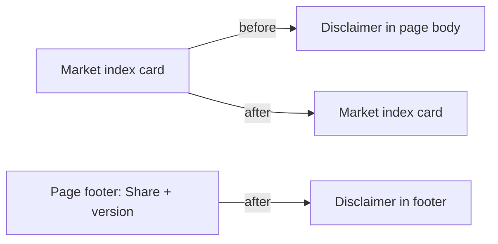

## Summary

Moved the Yahoo Finance data-source disclaimer ("Market data is fetched from
Yahoo Finance and shows performance from the score date to current date.") out
of the middle of the page — where it sat inside the Market Performance
Comparison card — and into the page `<footer>`, beside the existing Share
control. The note keeps its compact `.data-source-note` styling so it reads as
low-prominence footer chrome. Closes #566.

## Evidence

Screenshot captured against the live dashboard served locally; the attribution
now renders under the Share button in the footer, and no longer appears in the
Market Performance Comparison card.

## Test Plan

- Added `tests/data_source_disclaimer_footer_test.ts`:
  - `attribution lives inside the page footer` — asserts the text is between
    `<footer>` and `</footer>`.
  - `attribution no longer sits in the market-index card` — asserts the text
    appears exactly once and after the footer opens.
- Existing `tests/data_source_disclaimer_test.ts` (4 tests) still passes — the
  note remains discoverable, compact, and outside an alert banner.
- Full Deno suite: `deno test --allow-read tests/*.ts` → 1200 passed, 0 failed.
