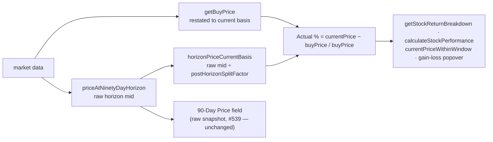

# Restate the dashboard Actual onto the buy price's current split basis

## Summary

The dashboard's Actual 90-day return divided a **current-basis** buy price by a
**raw** horizon price. `getBuyPrice` restates the score-date midpoint into
current (end-of-series) split terms, but the Actual readers took the horizon
midpoint **raw** (`(high + low) / 2`). When a reconcilable split falls **between
the 90-day horizon and the data end**, the raw Actual carries a spurious
post-horizon split factor `S_after` that GRQ training (and the
economically-correct return) cancels — distorting the displayed Actual.

This restates the Actual horizon price onto the **same** current basis as the
buy price, via the `GRQProjection.horizonPriceCurrentBasis` kernel (raw mid ÷
`postHorizonSplitFactor`) added in PR #568:

- **`getStockReturnBreakdown`** (`docs/app.js`) — the single source of truth for
  the displayed Actual / charts / popovers.
- **`currentPriceWithinWindow`** (`docs/trend_predictions.js`) — the Trend-view
  Actual.
- **`calculateStockPerformance`** (`docs/app.js`) — the twin 90-day return that
  feeds Return-above-cost-of-capital, judgement and projection surfaces. It
  shared the identical raw-over-restated defect and previously *agreed* with the
  Actual, so it is restated the same way to keep the two consistent for a stock
  that splits post-horizon.
- **Gain/Loss "show the working" popover** (`docs/app.js`) — its displayed price
  now uses the current basis so the shown arithmetic matches the (now-restated)
  Gain/Loss %, instead of contradicting it.

The standalone **"90-Day Price"** snapshot field deliberately keeps showing the
**raw** traded price at the horizon (issue #539) — it is a price display, not a
return, and the audit scoped the fix to the Actual return readers.

The `#555` parity diagnostic (`scripts/horizon_split_parity_diagnostic.ts`)
sourced its "raw" Actual from the shipped reader; now that the reader is fixed it
reconstructs the raw horizon midpoint independently
(`priceAtNinetyDayHorizon`) so it still quantifies the now-removed offset.

Closes #569.

## Evidence

This is a frontend/CLI logic change with no isolated web view to screenshot — the
effect is invisible for the ~98 % of rows with no post-horizon split (factor
1.0, value unchanged) and only moves the 123 split-affected rows. **Playwright
MCP was unavailable in this environment**, so verification is via the
reproducible diagnostic and unit tests that execute the real shipped code.

Reproducible diagnostic (`deno task diagnose-horizon-split-parity`, as-of
2026-06-26) — the measured impact matches the issue exactly:

```
Matured score dates:      274
Included stock-rows:      5444
Post-horizon split rows:  123
Per-row offset  min/max:  -316.116 pp / +1395.893 pp
Basis contribution:       +0.482 pp
VERDICT: ... RESOLVED in issue #569: the shipped readers now restate the Actual
through horizonPriceCurrentBasis so it shares the buy price's basis.
```

Worked example (2:1 forward split after the horizon): buy 100 → restated 50;
horizon mid 120 → restated 60. The Actual is now the real **+20 %** move, not the
spurious **+140 %** the raw 120 produced.

### Data flow



## Test Plan

New `tests/dashboard_actual_horizon_basis_test.ts` (11 tests) — executes the
**real shipped code** (the trend reader is imported and called; the `app.js`
methods are brace-matched from source and run with a fake `this`, not grepped):

- `currentPriceWithinWindow` restates forward and reverse post-horizon splits,
  is unchanged with no post-horizon split, and returns null with no usable point.
- `resolvePredictionStocks` Actual and buy price share the current basis (real
  +20 % move, not +140 %).
- `getStockReturnBreakdown` reads the Actual on the buy price's basis, is
  unchanged without a split, and returns null past the horizon.
- `calculateStockPerformance` restates the same way and **agrees with**
  `getStockReturnBreakdown` on the same basis.

Existing suites updated/confirmed:

- `tests/horizon_split_parity_diagnostic_test.ts` — passes against the diagnostic
  rewrite (raw reconstructed independently). No assertions weakened.
- Full Deno suite (1086 tests) and `./quality.sh` pass cleanly.
