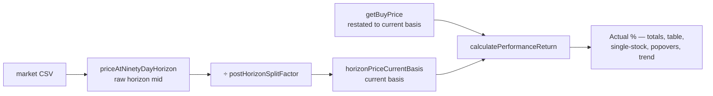

## Summary

The dashboard's **Actual 90-day return** divided a **current-basis** buy price
(restated to end-of-series split terms by `getBuyPrice`) by a **raw** horizon
price. When a reconcilable split fell **between the 90-day horizon and the end
of the data series**, the Actual carried a spurious post-horizon split factor
that the buy price did not — inflating (forward split) or deflating (reverse
split) the displayed Actual, while `Target %` was unaffected (it divides
`adjustedTarget` and `buyPrice` by the same factor).

This reads the Actual horizon price on the **same current basis** as the buy
price, via the `GRQProjection.horizonPriceCurrentBasis` helper (added in
PR #568, which divides the raw horizon midpoint by `postHorizonSplitFactor`).

The issue named `getStockReturnBreakdown` and `currentPriceWithinWindow`, but
the single-stock detail, the per-stock table column, the 90-Day Price field and
the "show the working" popovers read the horizon **raw** through separate code
paths. Fixing only the two named functions would have left the per-stock
Performance column contradicting the corrected totals row (the repo's invariant
is that popovers can never disagree with the displayed value). So every
horizon-Actual read on the dashboard now routes through `horizonPriceCurrentBasis`
for a consistent, split-correct Actual.

**Safety property:** `horizonPriceCurrentBasis === priceAtNinetyDayHorizon`
whenever there is no reconcilable post-horizon split (`postHorizonSplitFactor`
is `1.0`), so the only stocks whose displayed Actual changes are the 124 matured
rows that actually carry such a split. Every other figure is byte-identical.

Closes #569.

### Sites changed (all in `docs/`)

| Path | What it feeds |
| --- | --- |
| `getStockReturnBreakdown` (app.js) | Totals-row Actual/Dividends, portfolio chart point, `portfolio-actual` popover |
| `calculateStockPerformance` (app.js) | Single-stock detail Performance, judgement / status / progress workings |
| `getNinetyDayPrice` (app.js) | Per-stock table "90-Day Price" |
| `current-price` popover working (app.js) | Single-stock "90-Day Price" value + working |
| `gain-loss` popover working (app.js) | Single-stock Gain/Loss working |
| `currentPriceRaw` (app.js) | Fair-value / target colour thresholds |
| `currentPriceWithinWindow` (trend_predictions.js) | Trend view Actual series |

The portfolio Actual (`calculatePortfolioPerformance90Day`) and per-stock table
Performance already delegate to `getStockReturnBreakdown` via
`calculateStockPerformanceWithDilution`, so they inherit the fix.

### Diagnostic (issue #555) is now a regression guard

`scripts/horizon_split_parity_diagnostic.ts` measures the **shipped** Actual
against the current-basis Actual. With the shipped Actual fixed, the two now
coincide, so `deno task diagnose-horizon-split-parity` reports **0 post-horizon
split rows** and a **+0.000 pp** basis contribution (was +0.482 pp). It now
confirms the fix and guards against a regression: reintroducing the raw read
would make the offset reappear.

## Evidence

### Behaviour (NASDAQ:KLAC, score 2026-01-01 — a 10:1 post-horizon split)

| | Before | After |
| --- | --- | --- |
| Buy Price (restated) | $126.73 | $126.73 |
| 90-Day Price | ~$1 500 (raw) | ~$151 (current basis) |
| **Performance** | **+1 093%** | **+19.3%** |


### Data flow



### Diagnostic output (after fix)

```text
Post-horizon split rows:  0
Basis contribution:       +0.000 pp
VERDICT: ... DORMANT ... Issue #569 landed the fix ...
```

## Test Plan

- `tests/trend_predictions_test.ts`
  - `currentPriceWithinWindow - restates the horizon midpoint onto the current split basis (issue #569)` — fails against the unfixed code, passes after.
  - `currentPriceWithinWindow - unchanged when no post-horizon split follows` — confirms the no-split safety property.
  - `currentPriceWithinWindow - returns null with no usable points` — edge case.
  - `resolvePredictionStocks - Actual reads the post-horizon split on the buy price basis (issue #569)`.
- `tests/horizon_split_parity_diagnostic_test.ts`
  - `per-stock Actual composition is split-consistent across the horizon (issue #569)` — mirrors `calculateStockPerformance`'s kernel composition (the GRQValidator method needs the DOM, so it is exercised through its shared kernels): buy 50, current 60, Performance +20% (raw would be +140%).
  - **Business-logic change documented in-file:** `aggregateDate: the shipped Actual reads a post-horizon split on the buy price basis (issue #569)` (was `... desynchronises Actual but not Target`). The diagnostic measures the shipped kernels, so with the fix the two Actual bases coincide and 0 rows are split-affected. The `buildReport` tests still exercise the non-trivial (offset > 0) report path with synthetic aggregates.
- Full suite: `deno test --allow-read tests/` — 1056 passed, 0 failed.
- `deno fmt --check`, `deno lint`, `deno check` — clean.

No Rust sources were changed; the fix is confined to the dashboard JS, the
diagnostic, and Deno tests.
